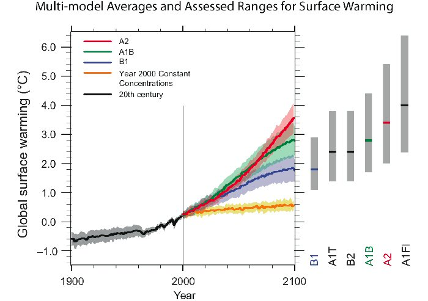
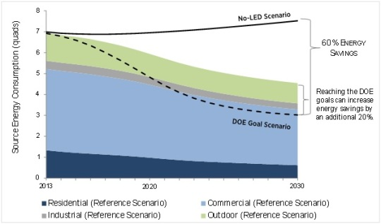
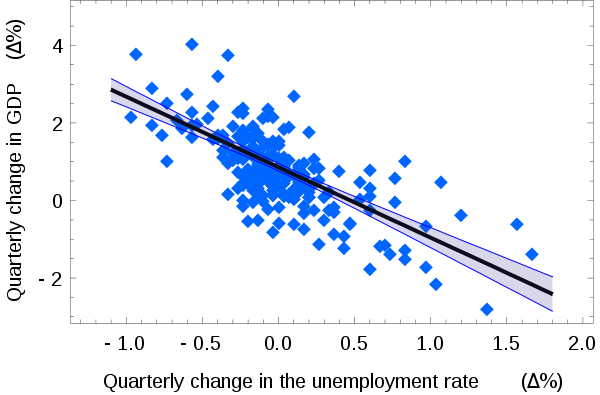

```{r setup, include=FALSE}
knitr::opts_chunk$set(echo = TRUE)
```

------------------------------------------------------------------------


# Mathematical Representation of this model

Precipitation = Evapotranspiration + Change in Storage

P = ET + ΔS

(at global scales ΔS includes streamflow since that water is still "stored" in the earth)

Water balance can tell you a lot


# Model Goals

Because models are only approximations of reality - the most important part of the modelling process is knowing **why** you want to build a model

Some broad types of goals

*Understanding* (how does something work, what are key drivers of responses, how do different drivers interact)

*Estimation/Scenario* (what might be the consequences of decisions we make about the environment, what might the environment look like if something changes)

*Communication* - contribute to education and broader understanding

Actual goal(s) needs to be more precisely defined

# Models for understanding(big \#'s, little \#'s as controls on phenomena)

The is often the role of *inverse inference* models - for example using a GCM to assess whether CO2 emissions can explain trends in warming temperature

This application of models is often in the form of a question

In a particular place (Baltimore Harbor), would temperature often be a limiting factor in eutrophication? At what times of year, would N-export matter more or less?


[US EPA Source](http://www.newworldencyclopedia.org/entry/File:Eutrophication.jpg)


# Models for estimation and what if scenarios

[IPCCC Projections](http://narccap.ucar.edu/about/figures/IPCCProjections.jpg)

Estimate of global temperatures over the next 100 years



# Models for estimation



[Estimate of energy savings from LED adoption](http://www.lightnowblog.com/2014/10/forecasted-energy-savings-from-led-lighting/)

# Modeling for Problem Solving in Environmental Science

-   There is something you need to know in order to solve the problem

    -   Answer to a question

        -   What if?
        -   How Much?
        -   Which Alternative?
        -   Why is this happening?

    -   Test a Hypothesis

# Modeling for Problem Solving in Environmental Science

-   Always start by clearly defining your goal as a questions (or hypothesis to be tested)

-   Examples?

# Models can also be for communication <Example:Glaciers>

Goal: Help public understand why, even if temperature warms - glaciers might grow (due to increasing snowfall) - but a threshold temperature might be reached where glacier will shrink

[Glacier model](https://phet.colorado.edu/sims/cheerpj/glaciers/latest/glaciers.html?simulation=glaciers)


# Model Goals

*Understanding* (how does something work, what are key drivers of responses, how do different drivers interact)

*Estimation/Scenario* (what might be the consequences of decisions we make about the environment)

*Communication* - contribute to education and broader understanding


# Conceptual Models

* models are **always** simplifications of reality - they help us to make sense of reality by focusing on specific aspects that are most relevant to your goal

* always start a modeling project by diagramming your conceptual model - how to you see the system; 
    * from here you design or choose your 'actual' model

* in a project, dialogue it is critical to dialogue to agree on the conceptual model

* "all models are wrong but some are useful" - British Statistician George Box


# Pair and Share

Share your conceptual model with a partner...Ask each other

-   how would this model help "understand" why an observed pattern occurs; is there something you could have done to make this inverse inference more clear

-   are the mechanisms that translate inputs to outputs clear; are there multiple mechanisms involved

-   what are some applications of this model - what would be the goal in that application

-   what are the core assumptions in the model

-   are there changes you would suggest to your partner's model


# Basic components of models

**Inputs** : Varying; think *x* of a *x* vs. *y* regression

**Parameters** : single values that influence relationships in the model

**Outputs** : what you want to estimate


# Simple model

**Input** : Change in unemployment rate

**Output** : Change in GDP

**Parameters** : Slope and intercept of the line

The US "changes in unemployment -- GDP growth" regression with the 95% confidence bands. 


# STEPS: Modeling for Problem Solving in ES

Clearly define your goal (a question you want to answer, hypothesis you want to test, prediction you want to make) - as precisely as possible

-   Design or Select your model

-   Implement the model

-   Evaluate the model and quantify uncertainty

-   Apply the model to the goal

-   Communicate model results


# Goals

The goal will help you to define the core pieces of a model

Often helpful to start at the end: Outputs

Problem: which piece of land should be purchased to maximize biodiversity?

Outputs: monetary costs and benefits of different options in 2015 dollars, including "non-market" benefits


# Goals

The goal will help you to define the core pieces of a model

Often helpful to start at the end: Outputs

Problem: how will forest carbon sequestration change if fire frequency increases with warming

Outputs carbon sequestration for different fire frequencies

# For Next Class


1. Fill out *Help us get to know you* survey on *Canvas*

2. Listen to *only* timestap 26:27 to 31:22  (basically 5 minutes) of the following blog by Lisa Felman Barrett - a highly cited psychologist

    * [blog  26:27 to 31:22](https://youtu.be/NbdRIVCBqNI?t=1587)

    * if you are interested you can learn
[More about Lisa Felman Barrett](https://www.affective-science.org/lisa-feldman-barrett.shtml)

    * Think about what an inverse inference problem might be in the context of the environment

3. Listen to this podcast on climate models - Pay particular attention to how Gavin Schmidt talks about the design, goal and **skill** of models

    * [The emergent pattersn of climate change](https://www.ted.com/talks/gavin_schmidt_the_emergent_patterns_of_climate_change?language=en)

    * If you are interested you can learn
[More about Gavid Schmidt](https://www.giss.nasa.gov/staff/gschmidt/)


4. After listening to these podcast, do the following

    a. Think of a conceptual model that you or someone else might use to understand some pattern that they observe in the environment (in other words a model that might help them to solve an inverse inference problem to understand the mechanisms that causes the observation)?
