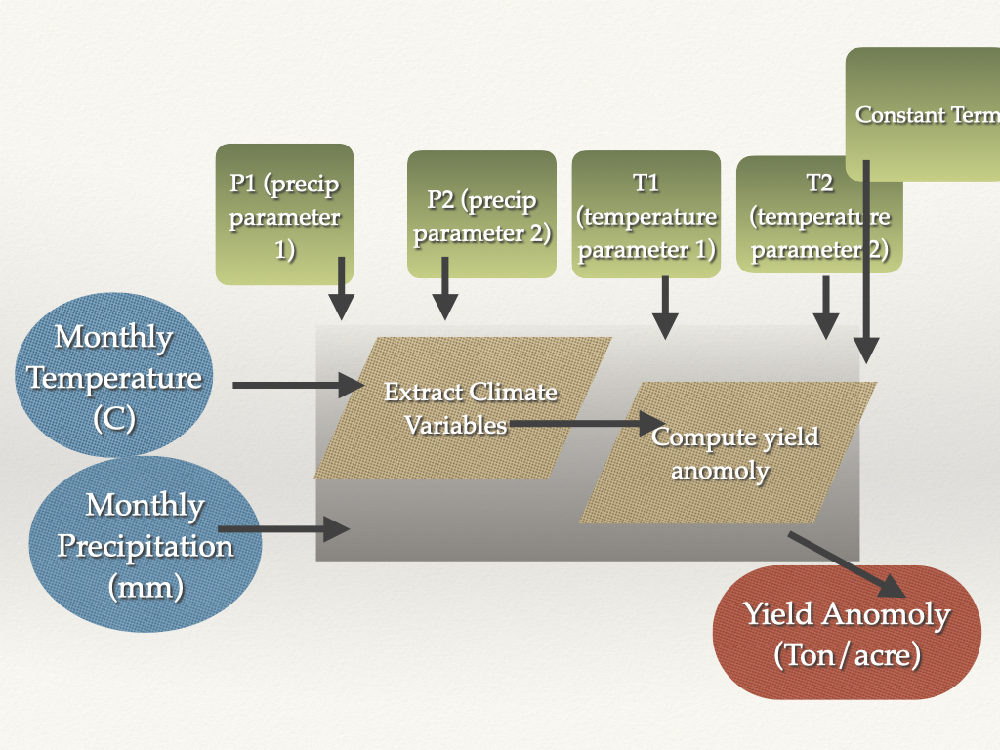
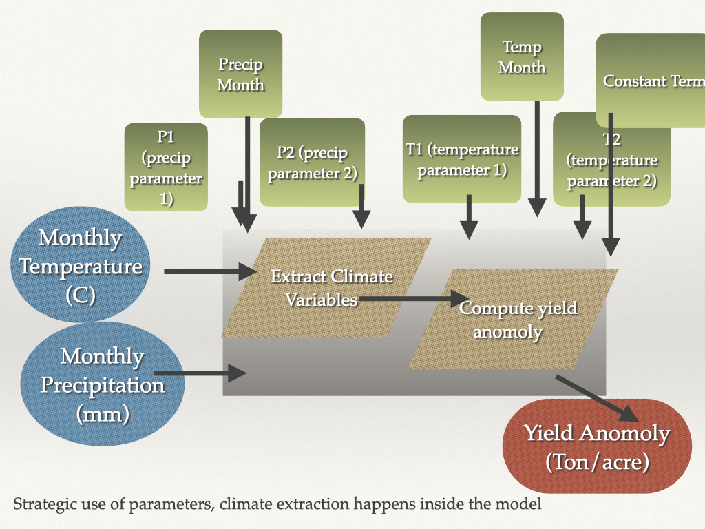

#  Steps for Design and Implement your model 

* Diagram your model

* Translate diagram into a mathematical representation

* Choose programming language

* Define inputs (data type, units)

* Define output (data type, units)

* Define model structure

* Write model

* Document the model  (meta data)

* Test model

#  Building Models 

Functions!

The basic building blocks of models

Functions can be written in all languages; in many languages (object-oriented) like C++, Python, functions are also objects

Functions are the “boxes” of the model - the transfer function that takes inputs and returns outputs

More complex models - made up of multiple functions; and nested functions (and main functions that call/user other functions and control the flow - the arrows between boxes)


#  Functions 

For each box/function Decide on 

 * Inputs and parameters

  * Outputs

Data types, units (time and space aggregation), names should be (use descriptive names)

**IMPORTANT**

Place each function in its own file (x.R), and put all functions for a given project in *R* subdirectory


#  From conceptual model to flow chart/workflow 

Impact of climate on almond productivity

What is almond productivity? OUTPUT

  * anomoly of yield

What is climate? INPUT

  * monthly precipitation and temperatures
  
Parameters

  * coefficients that determine the sensitivity of yield to climate variables
  

# model flow charts

```{r, out.width = "75%",out.height="75%", echo=FALSE}
knitr::include_graphics("lecture4_building_models/assets/img/simiple_conceptual_model.png")
```


```{r, out.width = "75%",out.height="75%", echo=FALSE}

```
 
 

```{r, out.width = "75%",out.height="75%", echo=FALSE}

```


# Almond yield examples

```{r}

library(tidyverse)
source("../R/compute_almond_yield.R")
compute_almond_yield

clim = read.table("../Data/clim.txt", header=T)
compute_almond_yield(clim)


```


#  What’s in the box 

Often more complicated than a simple single equation (regression results)

So we need to think through steps are - what is connected with what

Diagrams are a good place to start


#  Modularity - Discrete Tasks  

Hierarchical in level of details

Big chunks (coarse detail) -> progressively finer

Note ‘tasks’ that need to be repeated

All tasks should have inputs and outputs

```{r, out.width = "75%",out.height="75%", echo=FALSE}
knitr::include_graphics("lecture2.conceptual.simple/assets/img/model_basic.001.jpeg")
```


# Model design flowcharts

Some model designers uses standard symbols for the different model components 


Building Models


#  • PhD of Norman Crawford under supervision of Ray K Linsley at Stanford University in 1962 

Flow Charges


#   Composing Diagrams

Pictorial representation your model and what needs to be included in 
the model to answer your questions (or achieve your modelling goal)

There are many software tools available for generating conceptual models, I like


[Diagrams.net]{https://www.diagrams.net/}


#  SERI-Fire 

* More complex model couple sub-models ( may be a loose coupling where users connects submodels)

* How do ecological and human factors interact to influence fire regimes 


```{r, out.width = "75%",out.height="75%", echo=FALSE}
knitr::include_graphics("lecture2.conceptual.simple/assets/img/image9.png")
```

# Sharing Example R, Data and Rmarkdowns

[esm232_examples github site]{https://github.com/naomitague/ESM232_Examples.git} 

You can clone this repository and then pull before class to get example code and data

Remember that git does not like having nested repositories - so
keep working respoistories in separate directories


# Running functions with data - another example


[esm232_examples github site]{https://github.com/naomitague/ESM232_Examples.git} 

* solarpv.R
* InformalSensitivity.Rmd
* InformalSensitivity2.Rmd

# Solar function example


Design -  function that estimates solar pv power given inputs of radiation

Model inputs: solar radiation (daily direct and diffuse)

Model outputs: power generated each year and average power over time

Parameters: panel efficiency, system performance, units, type of array (uses diffuse or not), plot Y/N

Some of these options such as whether to plot determine outputs from the function

AND the type of array to determine whether it uses diffuse radiation, 
these parameters change how the function/model works

```{r solar}
source("../R/solarpv.R")
solarpv

# read in R formatted data
load("../Data/sierraczosolar.rda")

# already in the format required for the model
head(sierraczosolar)

# run the model
solarpv(area=0.1, solar=sierraczosolar, clr="green", eunit="W")

# run and save results - but don't plot
site1 = solarpv(area=0.1, solar=sierraczosolar, clr="green", eunit="W", g=FALSE)
site1$mean
site1$annual

# consider a different pv array that only uses 
# diffuse and has non standard efficiency (0.6)
site2 = solarpv(area=0.1, solar=sierraczosolar, clr="green", eunit="W", g=FALSE, eff=0.6, etype="direct")
site2$mean

# try some additional variations
```

# Informal Sensitivity Analysis

What happens when we vary parameters?

**Informal** - just try varying parameters

* decide  which parameter(s) and what range to vary the parameter over - what is the uncertainty? (+- 15% )?

* figure out how to efficiently run your model over parameter variation and save results as you go

* analyze the sensitivity (simply plotting for now)


# Helpful tools


* Sampling

    **runif**, **rnorm** (sampling from uniform and normal distributions)
    **seq** (for creating a sequence of numbers)
    
* Repeating 

  * in R - *purrr* package, also *apply* family of function
  
  * classic *for* loops
  
If you need it a good source to review working with *purrr* to extract items from list and repeat operations

[R description](purr.tidyverse.org)

[Useful Purrr Resource](https://www.rebeccabarter.com/blog/2019-08-19_purrr/)


  * we will start by using **map** - which "maps* a function (runs it ) for a list of values, we can
  also use these function to extract values from a list
  

# Rmarkdown code for informal sensitivity
```{r sen1, eval=T}

# lets try informal sensitivity analysis again, this time by varying efficiency if we don't know efficiency exactly , lets try 20 samples

# use map from purrr
# notice how map adds the one parameter that is missing from the input list
eff = rnorm(mean=0.6, sd = 0.1, n=20)
site2 = eff %>% map(~solarpv( area=0.1, solar=sierraczosolar, clr="green", eunit="W", g=FALSE, etype="direct", eff=.x ))

head(site2)

# this is pretty messy - but we can extract a useful data structure,lets say we want 
# just the annual data (not the mean annual time series), and then reformat as a data frame with nice column names
tmp = map_df(site2,`[`, c("annual")) 

site2df = data.frame(year = tmp$annual$year, elect= tmp$annual$elect)

# now we could plot
ggplot(site2df, aes(year,elect, group=year ))+geom_boxplot()+labs(y="Electricity generated in W")

# we also might want an average across parameter uncertainty
site2_average = site2df %>% group_by(year) %>% dplyr::summarize(elect=mean(elect))

# now add this to the plot - note that we remove the grouping by using group=1
ggplot(site2df, aes(year,elect, group=year))+geom_boxplot()+labs(y="Electricity in W")+
  geom_line(data=site2_average, aes(year, elect, group=1), col="orange")

# we could also plot how the mean annual electricity varies with efficiency (eff from above)
site2[[1]]

tmp = map_df(site2,`[`, c("mean")) 

# how variable is electricity generation (mean over all time) with uncertainty in solar efficiency

site2_mean = data.frame(eff=eff, elect= tmp)
ggplot(site2_mean, aes(y=mean))+geom_boxplot()+
  labs(x="Electricity in W")

# or to see what the sensitivity looks like
ggplot(site2_mean, aes(eff, mean))+geom_point()+
  labs(y="Electricity in W", x="Solar Efficiency")

```


# In class practice

Try doing some informal  sensitivity analysis with your almond yield function

* what parameter might you vary
* how do you come up with samples across that variation
* how do you run the function across the samples
  * using **map** from **purrr*
  * are there other ways **for loops**...
  
 
Before Thursday's class Review Rmarkdowns 

* InformalSensitivity.Rmd
* InformalSensitivity2.Rmd


