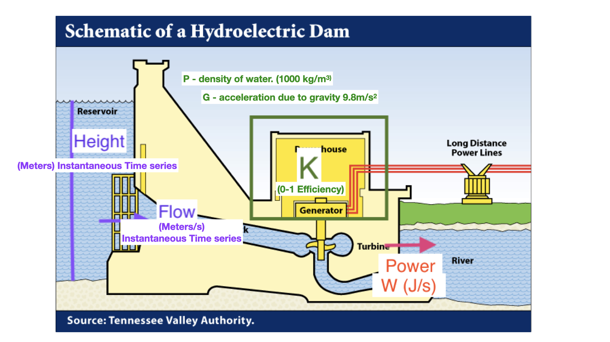

#  Best practices for model (software) development 

Common problems

Unreadable code (hard to understand, easy to forget how it works, hard to find errors, hard to expand)

Overly complex, disorganized code (hard to find errors; hard to modify-expand)

Insufficient testing (both during development and after)

Not tracking code changes (multiple versions, which is correct?)

---

#  Best practices for model (software) development 

Basic Solution

Structured practices that ensures
clear, readable code 

* meaningful variables names 

* comments to explain the workflow

* documentation to explain functionality 

* modularity (organized “independent” building blocks)
testing as you go and after

* code evolution is documented (version control)

---

#  Best practices for model (software) development 


Automated Documentation with *Oxygen*

[Oxygen in XML - Original](https://www.oxygenxml.com/)

[ROxygen - works with R](https://cran.r-project.org/web/packages/roxygen2/vignettes/roxygen2.html)

Automated Testing
[ Testing in R](https://r-pkgs.org/tests.html)

Version Control - Github

---

#  Modularity - Discrete Tasks -  

Hierarchical in level of details

Big chunks (coarse detail) -> progressively finer

Note ‘tasks’ that need to be repeated

All tasks should have inputs and outputs


#  From conceptual model to flow chart/workflow 

Impact of climate on almond productivity

What is almond productivity?

What is climate?

---

```{r, out.width = "75%",out.height="75%", echo=FALSE}
knitr::include_graphics("lecture4_building_models/assets/img/simiple_conceptual_model.png")
```

---

```{r, out.width = "75%",out.height="75%", echo=FALSE}
knitr::include_graphics("lecture4_building_models/assets/img/fuller_almond_CM.jpeg")
```
 
--- 

```{r, out.width = "75%",out.height="75%", echo=FALSE}
knitr::include_graphics("lecture4_building_models/assets/img/more_general_almond_CM.jpeg")
```

---

#  Building Models 

Functions!

The basic building blocks of models

Functions can be written in all languages; in many languages (object-oriented) like C++, Python, functions are also objects

Functions are the “boxes” of the model - the transfer function that takes inputs and returns outputs

More complex models - made up of multiple functions; and nested functions (and main functions that call/user other functions and control the flow - the arrows between boxes)

---

#  Functions 

Write down:


all inputs and parameters

all outputs

Decide what there data types, units, names should be

use descriptive names

use data types that will allow you to apply your function in many different cases

---

#  Functions 

Write down what the function will do - given different inputs and parameters

simple
input (temperature); output (growth rate)

more complex
inputs (temperature, organism type)
output (if animal, respiration; if plant, growth)

---

#  Implementing Functions in R 

Format for a basic function in R

 #’ documentation that describes inputs, outputs and what thefunction does
FUNCTION NAME = function(inputs, parameters) {
body of the function (manipulation of inputs)
return
}

In R, inputs and parameters are treated the same; but it is useful to think about them separately in designing the model - collectively they are sometimes referred to as arguments

**IMPORTANT**
Place each function in its own file (x.R), and put all functions for a given project in *R* subdirectory
---

#   Example 

```{r, out.width = "75%",out.height="75%", echo=FALSE}

```

* Input: Reservoir height (height) and flow rate (flow)
* Output: Instantaneous power generation (W/s)

* Parameters: K Efficiency , ρ (density of water), g (acceleration due to gravity)

P = ρ * h * r * g * K Efficiency;

P is Power in watts, ρ is the density of water (~1000 kg/m3), h is height in meters, r is flow rate in cubic meters per second, g is acceleration due to gravity of 9.8 m/s2, K Efficiency is a coefficient of efficiency ranging from 0 to 1.

This is a static (one point in time), deterministic, lumped (one place) model; its more or less physically based

---

#  Building Models 

Inputs/parameters are height, flow, rho, g, and K

For some (particularly parameters) we provide default values by assigning them a value (e.g Keff = 0.8), but we can overwrite these

Body is the equations between { and }
*return* tells R what the output is

```{r eval=TRUE}
library(tidyverse)
power_gen = function(height, flow, rho=1000, g=9.8, Keff=0.8) {

result = rho * height * flow * g * Keff
return(result)
}

power_gen(height=10, flow=2)
power_gen(10,2)
power_gen(10,2, g=4.2)

# generate some test data
measured_height=runif(min=1, max=100, n=20)

# create a data frame to store results of model run
power_estimate = cbind.data.frame(height=measured_height, estimate=power_gen(height=measured_height, flow=2))

# graph
ggplot(power_estimate,aes(height, estimate) )+geom_point()+labs(y="power in W/x", x="height (m)")
```

---

#   Building Models 

Another example: Okuns Law (conceptual, abstract model) - try implementing this as a function

Graph of US quarterly data (not annualized) from 1947 through 2002 estimates a form of the difference version of 

Okun's law:

**%Change GNP = 0.856 - 1.827(Change Unemployment Rate)** 

R\^2 of .504. 

Differences from other results are partly due to the use of quarterly data
http://en.wikipedia.org/wiki/Okun%27s_law

Write the function in R!

what is change in GDP for unemployment rate change of 3%

what would the change in GDP be for 3% change in unemployment rate if the slope was 10% higher


---

```{r}

okum = function(deltaEmp, slope=1.827, intercept=0.856) {
  deltaGDP = slope*deltaEmp + intercept
  return(deltaGDP)
}

okum(3)
okum(3, slope=1.827*(1.1))
```


#  Best practices for model (software) development 

" *Let us change our traditional attitude to the construction of programs: Instead of imagining that our main task is to instruct a computer what to do, let us concentrate rather on explaining to humans what we want the computer to do. -- Donald E. Knuth, Literate Programming, 1984* "

Developing readable (by PEOPLE) code and documenting what you are doing is essential

*“When was the last time you spent a pleasant evening in a comfortable chair, reading a good program?”— Bentley (1986)*

---

```{r eval=TRUE, echo=TRUE}
#' Power Generation
#'
#' This function computes instantaneous power generation
#’ from a reservoir given its height and flow rate into turbines
#' @param rho Density of water (kg/m3) Default is 1000
#' @param g Acceleration due to gravity (m/sec2) Default is 9.8
#' @param Kefficiency Turbine Efficiency (0-1) Default is 0.8
#' @param height height of water in reservoir (m)
#' @param flow flow rate (m3/sec)
#' @author Naomi
#' @examples power_gen(20, 1)
#' @return Power generation (W/s)


power_gen = function(height, flow, rho=1000, g=9.8, Keff=0.8) {

 

  # calculate power
    result = rho * height * (flow) * g * Keff


  return(result)
}
```

# Sharing Example R, Data and Rmarkdowns

[esm232_examples github site]{https://github.com/naomitague/ESM232_Examples.git} 

You can clone this repository and then pull before class to get example code and data

Just remember that git does not like having nest repositories - so
keep working respoistories in separate directories

#  Documentation! 

Makes it easier for you to fix issues, refine and easier for others to use

For functions (model) you should always include the following in your code

The goal of the model

Model inputs (description, name and units)

Model output (description, name and units)

Where the transfer function comes from (source papers)

In line explanation for key steps

Always use meaningful names for functions, variables, inputs and outputs

Always put your function in its own file - with just the documentation

---

#  Building Models:Documentation 

There is also a standard format for documentation that can be read by automatic programs (roxygen2) - an R package that generate “standard” R documentation - manual or help pages

These automated approaches for building documentation (like roxygen2) and meta data (descriptions of data sets) are increasingly common - so you should get into the practice of being structured in your approach to documentation

We will use the conventions that work with roxygen2 - and then use this program to generate formal R documentation. Roxygen is similar to Doxygen which is used for C code…so its a widely used format

# Assignment


