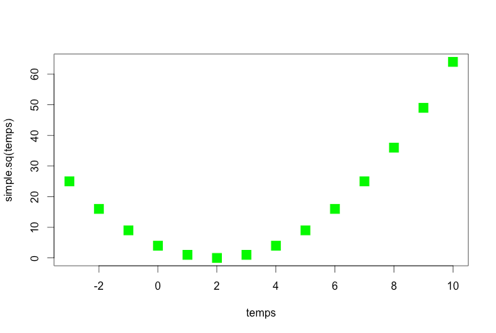
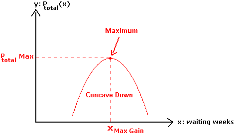
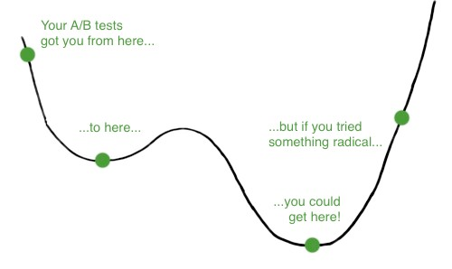
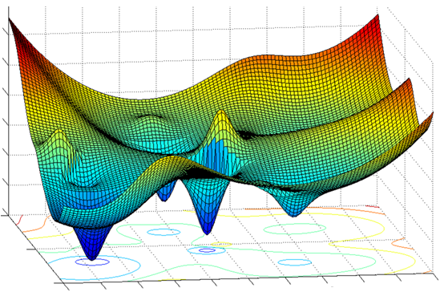

---

.pull-left[]

.pull-right[]

---
#  Optimization 

Optimization in modeling, **identify** :
the *objective/output* that you want to minimize
the *parameters* (or inputs) that you can “play” with to change the output
the *model* (or set of models) that define the relationship between the output and the parameters

---
#  Optimization 

*Objective* - based on your output variable (or some transformation of it)
the output variable may be multi-dimensional
trying to minimize two or more things at the same time
minimize energy use and water use
maximize profit and minimize energy use

---
#  Optimization 

in modeling, identify:
the *objective* that you want to minimize
the *parameters* (or inputs) that you can “play” with to change the output - “free” parameters
the model (or set of models) that define the relationship between the output and the parameters

---
#  Optimization 

You can have more than one “free” parameters
minimizing energy use by changing both time of day that  the plant functions and the operating temperature
minimizing air pollution by reducing the number of drivers and the time spent driving
maximizing species richness by increasing fire frequency and reducing fire severity

---
#  Optimization 

Single free parameter - e.g minimize energy use as a function of temperature
Two free parameters - Minimize energy use as a function of temperature AND type of substrate/material
.pull-left[]

.pull-right[]

---
#  Optimization 

Objective - what you are trying to minimize
Objectives using two or more variables
pareto optimality
point where any change in one variable will reduce objective for the other variable (balancing your multiple objectives)
define an objective function (single variable) that combines the two variables
useful because you can decide on the weighting
0.5*energy.use + 0.5*cost
0.8*energy.use + 0.2*cost
make sure that energy.use and costs are relative values to that it makes sense to add them

---
#  Optimization 

How easy the optimization is depends on the model - or the functional relationship between free parameters and output
Three possibilities
the minimum can be derived mathematically
you can graph the relationships and “see” the minimum
you get there by trial and error - we have very sophisticated ways of doing the “trial and error”

---
#  Optimization 

http://derivative-functions.cours-de-math.eu/advanced-math-english14.php
Export prices
Finding the “optimal” value of the parameter (waiting weeks) and the value of the objective function at the optimum is visually easy to assess

[Optimization](http://derivative-functions.cours-de-math.eu/advanced-math-english14.php)
[http://derivative-functions.cours-de-math.eu/advanced-math-english14.php](http://derivative-functions.cours-de-math.eu/advanced-math-english14.php)
[Export prices](http://derivative-functions.cours-de-math.eu/advanced-math-english14.php)
[Finding the “optimal” value of the parameter (waiting weeks) and the value of the objective function at the optimum is visually easy to assess](http://derivative-functions.cours-de-math.eu/advanced-math-english14.php)

---

[Optimization approaches vary in terms of](http://www.smashingmagazine.com/2010/08/26/in-defense-of-a-b-testing/)
[- ability to find non-local optima](http://www.smashingmagazine.com/2010/08/26/in-defense-of-a-b-testing/)
[- ability to handle multiple criteria](http://www.smashingmagazine.com/2010/08/26/in-defense-of-a-b-testing/)
[http://www.smashingmagazine.com/2010/08/26/in-defense-of-a-b-testing/](http://www.smashingmagazine.com/2010/08/26/in-defense-of-a-b-testing/)
[Calibration:](http://www.smashingmagazine.com/2010/08/26/in-defense-of-a-b-testing/)
[Sampling the parameter space - Optimization ](http://www.smashingmagazine.com/2010/08/26/in-defense-of-a-b-testing/)

---
#  Optimization 

An interactive approach - keep “bracketing” the function
https://www.uam.es/personal_pdi/ciencias/ppou/CNC/TEMA6/f10.pdf

---
#  Optimization 

But this might get you to a “non” local minimum
https://www.uam.es/personal_pdi/ciencias/ppou/CNC/TEMA6/f10.pdf

---
#  Optimization 

---

www.mathworks.com

[www.mathworks.com](http://www.mathworks.com)

---
#  Optimization 

www.frankfurt-consulting.de
Math geeks and engineers have developed all kinds of strategies for search parameter spaces to find minimum, that deal with complex spaces with lots non-local minimum

[Optimization](http://www.frankfurt-consulting.de)
[www.frankfurt-consulting.de](http://www.frankfurt-consulting.de)
[Math geeks and engineers have developed all kinds of strategies for search parameter spaces to find minimum, that deal with complex spaces with lots non-local minimum](http://www.frankfurt-consulting.de)

---
#  Optimization 

One more distinction
Constrained vs unconstrained
unconstrained …what we’ve been looking at
constrained….add rules about what parameters can be selected (e.g  you must purchase at least 20 units of x)

---
#  Optimization 

Optimization of more complex models - almost always requires one of these “search” techniques
- think about coming up with the optimal sea wall size in the 			mangrove model
Optimization techniques are also used for calibrating models - where the objective is the fit between model estimates and observations - we will get to that

---
#  Optimization in R 

Different functions available that help with
automate the “searching” for you: smart searching!
dealing with multi-dimensional search spaces
dealing with complex (multi-min, multi-max) search spaces
constrained/unconstrained
optimize() - one dimensional
optim(), nlm() , nlminb()

---
#  Optimization in R 

similar to using an *ode* solve a differential equation
in some cases, you can solve it directly - you can use math/graphs to find the optimal value - other wise you iterate - R can help you do that
two steps
code your model as a function
send function, and parameters to the optimizer
the optimizer search for a minimum value of the model output

---
#  Optimization in R 

pollutant.expt = function ( x ) {
result =( (x-2)**2)
return(result)
}
temps = seq(from=-3,to=10)
plot(temps, pollutant.expt(temps), col=‘green’, cex=2)
Simple example: manufacturing process production pollutant output as function of the temperature setting
What is the “best” temperature to use?
Criteria: minimize pollutant

---
#  Optimization in R 

Use “optimize” in R,
*Optimize* (function to be minimized, lower bound, upper bound..)
Can also provide:
tol	- tolerance (how close do you have to get )
maximum  - if maximum=T, finds the maximum; default is finding the minimum

---
#  Optimization in R 

pollutant.expt = function ( x ) {
result =( (x-2)**2)
return(result)
}
> result = optimize(pollutant.expt, lower=-3, upper=10)
>
> result
$minimum
[1] 2
$objective
[1] 0
What is the “best” temperature to use? Criteria: minimize cost

---
#  Optimization in R 

A slightly more complicated example….
Lets say we have an option to purchase irrigation water; the contract requires us to commit to purchasing the irrigation water for a number of years in the future; we want to know how much irrigation water to purchase to maximize our profit from growing almonds (or some other crop)

---
#  Optimization in R 

What we have
we have a model of yield as a function of irrigation and climate
we have a cost of irrigation water and prices for yields
we have all of this for 10 years

---
#  Optimization in R 

Compute_profit
Compute_yield
Compute_NPV
Crop Parameters
Growing Season T
Precipitation
“Fixed” Parameters
Price per yield
Cost of irrigation water
Discount rate
“Fixed” Parameters
Free Parameter
Irrigation
Optimize (compute profit, lower value for irrigation, upper value for irrigation, other fixed parameters, maximum=T)

---
#  Optimization in R 

Profit model
output: total profit after n years
inputs: inputs for yield model (growing season temperature (T) and annual precipitation (P), irrigation/year (irr), crop.pars), price of that crop gets (price), cost of irrigation water (cost)
calculate yield in each year- from our yield model
income is price*yield in each year
cost is irrigation * number of years
net = income - costs
find net present value of net

---
#  Optimization in R 

Profit model
#' compute net profit'
#'
#' Function to compute profits
#' @param T annual temperature
#' @param P annual precip
#' @param irr
#' @param discount
#' @param price  of fruit
#' @param cost of irrigation
#' @return profit
compute_profit = function(T,P, irr, discount, price, cost, crop.pars) {
total=0.0;
nyears = length(T)
yields= compute_yield(T=T,P=P, irr=irr, crop.pars)
income = price * yields
costs = rep(irr * cost, times=nyears)
net = income-costs
for (i in 1: nyears) {
total = total+compute_NPV(net[i], i, discount)
}
return(total)
}

---
#  Optimization in R 

Net Present Value
#' compute_NPV
#'
#' compute net present value
#' @param value/cost ($)
#' @param time in the future that cost/value occurs (years)
#' @param discount rate
#' @return value in $
compute_NPV = function(value, time, discount) {
result = value / (1 + discount)**time
result
}

---
#  Optimize in R 

Lets say we have 3 years of temperature and precipitation data, and price of almonds is $50/kg and irrigation water will cost us $150 per unit; and we know the crop specific parameters for almonds - how much irrigation water should we buy?
.pull-left[]

.pull-right[]
