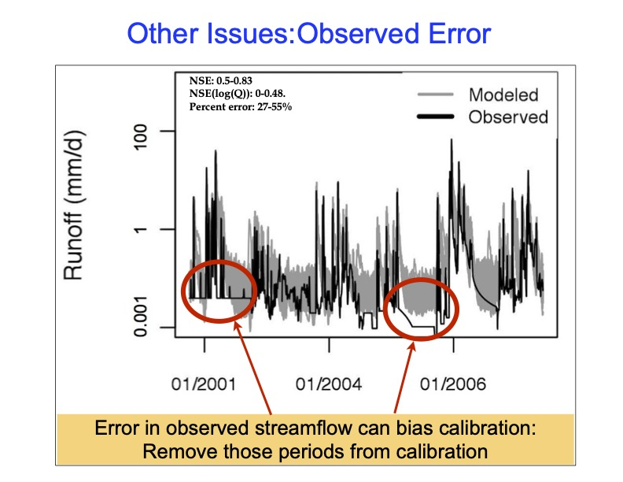

```{r setup, include=FALSE}
knitr::opts_chunk$set(echo = TRUE)

library(sensitivity)
library(tidyverse)
library(lubridate)
library(reldist)
library(purrr)
library(ggpubr)
```

# Calibration (Review from last class)
```{r simple}

sager = read.table("../Data/sager.txt", header=T)
head(sager)

# add date
sager = sager %>% mutate(date = paste(day,month,year, sep="/"))
sager$date = as.Date(sager$date,"%d/%m/%Y")

# plot
sagerl = sager %>% pivot_longer(cols=c("model","obs"), names_to="source",
                                  values_to="flow")

# basic plot
p1=ggplot(sagerl, aes(date, flow, col=source, linetype=source))+geom_line()

p2=ggplot(subset(sagerl, wy==1980), aes(date, flow, col=source, linetype=source))+geom_line()+scale_y_continuous(trans="log")+labs(y="streamflow mm/day")

# look at it another way with 1:1 line 
ggarrange(p1,p2, ncol=1)


```


# Calibration

Calibration is picking parameter sets based on performance evaluation

Apply metrics over multiple outputs (generated by running across many parameters sets) - like we've done in our sensitivity analysis work

**Example** - a dataset where each column
is a different model run for Sagehen Creek
(using different parameters) - don't worry about the parameters for now

* sagerm.txt

# Split-Sample

**Split-sample**: split time period into 

  * calibration time period (used to pick parameter sets)
  
  * validation time period (used to see how well chose paramter sets perform)
  

  
# Read in data plot results for an example year (1974)

```{r multiple1}

# multiple results - lets say we've run the model for multiple years, 
#each column  is streamflow for a different parameter set
msage = read.table("../Data/sagerm.txt", header=T)

# keep track of number of simulations (e.g results for each parameter set) 
# use as a column names
nsim = ncol(msage)
snames = sprintf("S%d",seq(from=1, to=nsim))
colnames(msage)=snames


# lets say we know the start date from our earlier output
msage$date = sager$date
msage$month = sager$month
msage$year = sager$year
msage$day = sager$day
msage$wy = sager$wy

# lets add observed
msage = left_join(msage, sager[,c("obs","date")], by=c("date"))

head(msage)
# how can we plot all results - lets plot water year 1970 otherwise its hard to see
msagel = msage %>% pivot_longer(cols=!c(date, month, year, day,wy), names_to="run", values_to="flow")

p1=ggplot(subset(msagel, wy ==1974), aes(as.Date(date), flow, col=run))+geom_line()+theme(legend.position = "none")
# lets add observed streamflow
p1=p1+geom_line(data=subset(sager, wy == 1974), aes(as.Date(date), obs), size=2, col="black", linetype=2)+labs(y="Streamflow", x="Date")

p1

```

# Calibration Metrics

creaete and apply your function


```{r figurefuzzy, echo=FALSE, fig.cap="Equifinality", out.width = '90%'}
knitr::include_graphics("../img/fuzzy.jpg")
```

# Apply calibration metrics to your model


```{r multiple}

source("../R/nse.R")
source("../R/relerr.R")
# subset for split sample calibration
short_msage = subset(msage, wy < 1975)

# compute performance measures for output from all parameters
res = short_msage %>% select(!c("date","month","year","day","wy","obs")) %>%
      map_dbl(nse, short_msage$obs) # purrr function here! map_dbl will apply the function nse() to each column in our data frame against the observed and returns a vector

head(res)


# another example using our low flow statistics
# use apply to compute for all the data
source("../R/compute_lowflowmetrics_all.R")
res = short_msage %>% select(-date, -month, -day, -year, -wy, -obs ) %>%
  map_df(compute_lowflowmetrics_all, o=short_msage$obs, month=short_msage$month, day=short_msage$day, year=short_msage$year, wy=short_msage$wy)
# note here we use map_df to get a dataframe back 


# interesting to look at range of metrics - could use this to decide on
# acceptable values
summary(res)
# we can add a row that links with simulation number
res$sim = snames

# graph range of performance measures
resl = res %>% pivot_longer(-sim, names_to="metric", values_to="value")

ggplot(resl, aes(metric, value))+geom_boxplot()+facet_wrap(~metric, scales="free")


```

# Explore how 'good' parameters compare with "bad" parameters

Extract out the "best" and "worst" parameter set

```{r extract}
# select the best one based on the combined metric
best = res[which.max(res$combined),]

# running the model forward
# so we can look at the full time series

# lets start with streamflow estimates from best performing parameter set
 ggplot(msage, aes(date, msage[,best$sim])) + geom_line()+geom_line(aes(date, obs), col="red") 

 
# for comparison lets consider how worst and best parameters perform for subsequent simulations
# focusing specifically on August streamflow
 worst = res[which.min(res$combined),]
 
 compruns = msage %>% select(best$sim, worst$sim, date, obs, month, day, year, wy)
 compruns = subset(compruns, wy > 1970)
 compruns_mwy = compruns %>% select(-c(day,date, year)) %>% group_by(month, wy) %>% summarize(across(everything(), mean))
 
 compruns_mwyl = compruns_mwy %>% pivot_longer(cols=!c(month,wy), names_to="sim", values_to="flow")
 compruns_mwyl %>% subset(month==8) %>% ggplot(aes(sim,flow ))+geom_boxplot()
 


```


# More on calibration - some complications

<span style="color: orange;">Equifinality</span>.

Many parameter values can give equal
performance


```{r figurename, echo=FALSE, fig.cap="Equifinality", out.width = '90%'}
knitr::include_graphics("../img/eqnfig1.jpg")
```

# Other Issues

* comparison with observed data is
limited

*errors in observed data


```{r figurename2, echo=FALSE, fig.cap="Equifinality", out.width = '90%'}

```


# Why picking the "best" parameter set may not be ideal


Parameter optimization/evaluation: will not be
robust

* calibration period is limited
* different performance measure give different "best" parameters
* input/measurement errors
*  equifinality
* overfitting in time and space


# A possible approach 

Bayesian, or simply use all "acceptible" parameter sets


* assess the likelihood of different models +
parameters being good predictors of the system of
interest

* reject (give zero likelihood) those models that are
clearly not good predictors of calibration data

* Can be done with different model structures as well
as different parameter sets

# Steps

Keep all parameter sets that are acceptable

* acceptable: above some threshold of performance

* always run the model for those parameter sets and
use range of model output to define uncertainty
bound

*if* you need a single model estimate:

* combine results from all acceptable parameters
* average
»weight by performance

# Steps 2


```{r figurename3, echo=FALSE, fig.cap="Equifinality", out.width = '90%'}
knitr::include_graphics("../img/eqnfig3.jpg")
```
# Generalized Likelihood Uncertainty Estimate< (GLUE)

<span style="color: orange;">Generalized Likelihood Uncertainty Estimate</span>.

Beven, JH, 2006, Manifesto for the Equifinality Thesi


How to do a maximum likelihood estimate of model results in R

# Glue - generalized uncertainty analysis

What if we wanted to keep all of the 'good' parameters

* we could just keep them all as equally likely
* we could weight them by performance

Either way we can graph and come up with 'best' prediction accounting for uncertainty

# Calibration with GLUE

Create a single measure of accuracy - above we used *compute_lowlowmetrics_all* to compute an accuracy measure based on

* relative error in annual minimum flow estimate
* relative error in monthly flow during low flow period
* correlation between observed and modelled annual minimum flow
* correlation between observed and modelled flow during the low flow period

We weighted all 4 the same

# Use the accuracy measure 

We can use the combined accuracy measure to define behavioural (acceptable) parameter set (**res_acc**) - two options

* define a threshold for acceptability (we will use 30%)
* take top 50 performing parameter sets

(we go with the latter but code could be commented to go with threshold approach)

# Define behavioral / acceptable parameter set
<a id="behavioral"></a>

```{r behavioral, echo=TRUE}

summary(res$combined)

# 1) selecting behaviorial or acceptable parameters sets

threshold = 0.3
res_acc = subset(res, combined > threshold)
head(res_acc)

# as an alternative  what if you want the top N parameter sets
topN = 50
tmp = res[order(res$combined,decreasing=T),]  # reorder from highest to lowest 
res_acc=tmp[1:topN,] # select the highest 50 
head(res_acc)

```

# Defining weights (likelihood) for parameter sets

Now define "weights" (likelihood) based on parameter performance for the acceptable or behaviorial parameters

We want the sum of the weights to equal 1

* accuracy measure defined above will define weight
* we divide by the sum of all accuracy measures to get fractions that add to 1
* note we now only work with behavioural parameter sets (in ** res_acc ** versus ** res **)

```{r weighting, echo=TRUE}

# create a weight for each parameter set based on its relative accuracy - we do this so all weights sum to 1
sum_acc=sum(res_acc$combined)
res_acc$wt_acc=res_acc$combined/sum_acc

head(res_acc[,c("sim","combined","wt_acc")])

# look at values
summary(res_acc$wt_acc)

# check to see that they sum to one
sum(res_acc$wt_acc)

Nacc = nrow(res_acc)
Nacc
```

# Using weights

One way to use weights is to define a maximum likelihood estimate by averaging (weighted by accuracy) streamflow from all behavioural simulations 

```{r glue2, echo=FALSE, fig.cap="Equifinality", out.width = '90%'}
knitr::include_graphics("../img/glue2.jpg")
```


```{r mle, echo=TRUE}

# generate a streamflow as weighted average of all  acceptable parameter sets

# recall that msagel is the flow data for all runs so we 
# can link with weights from res_acc by run id
msagel  =  msage %>% pivot_longer(cols=!c(date, month, year, day,wy, obs), names_to="sim", values_to="flow")


# subset only acceptable runs
msagel_acc = subset(msagel, sim %in% res_acc$sim)
# join with weights from res_acc, left_join will repeat weights for each day in streamflow trajectory
msagel_acc = left_join(msagel_acc, res_acc, by="sim")

# finally multiply flow by weight
msagel_acc = msagel_acc %>% mutate(flow_wt = flow*wt_acc)

head(msagel_acc[,c("date","obs","sim","flow","combined","wt_acc","flow_wt")])

# now we can average streamflow for each day from all the runs # using the weights
aver_flow = msagel_acc %>% group_by(date) %>% dplyr::summarize(meanstr = sum(flow_wt))

# add some date information or simply add to simQ

ggplot(aver_flow, aes(x=date, y=meanstr))+geom_line(col="red")+labs(y="Streamflow mm/day")

# add some of the other date info and plot a subset
aver_flow$wy = msage$wy
wycheck=1985
ggplot(subset(aver_flow, wy == wycheck), aes(x=date, y=meanstr, col="model_wt"))+
  geom_line()+labs(y="Streamflow mm/day")+
  geom_line(data=subset(msage, wy==wycheck), aes(date, obs, col="obs")) 

```

# Final step of GLUE

We could also compute quantiles rather than just mean


We can use the `wtd.quantile()` function in the `reldist` package to do this - it computes quantiles accounting for different weights on each observation

```{r plotting, echo=TRUE}
 
# compute quantiles based on performance weights
quant_flow = msagel_acc %>% group_by(date) %>% dplyr::summarize(
  flow10=wtd.quantile(x=flow, weight=wt_acc, q=0.1),
  flow50=wtd.quantile(x=flow, weight=wt_acc, q=0.5),
  flow90=wtd.quantile(x=flow, weight=wt_acc, q=0.9)
)


# ad observed back
quant_flow_obs = left_join(quant_flow, msage[,c("date","month","year", "day","wy","obs")], 
                       by=c("date"))

# format for plotting
quant_flowl = quant_flow_obs %>% pivot_longer(col=c(flow10, flow50, flow90, obs), 
                                          values_to="flow", names_to="quantile")

# plot
ggplot(subset(quant_flowl, wy==1985), aes(date, flow, col=quantile))+geom_line()

# to see low flows, transform y-axis
ggplot(subset(quant_flowl, wy==1980), aes(date, flow, col=quantile))+
  geom_line()+scale_y_continuous(trans="log")


```

# Extra Credit

Final piece will be to produce a graph of maximum likelihood estimate given you acceptable parameters!

To hand in - an Rmarkdown and R function.
  
  * Part 3  (OPTIONAL)

    1. Use the performance measure to select "acceptable" outcomes from parameter sets 
    2. Compute the range of the performance measure using only the "acceptable" outcomes over the post-calibration period (part that you didn't use for calibration in step 1)
    3. Graph the range of outcomes for acceptable parameters (e.g post-calibration parameter uncertainty); you can choose what output is most interesting for you 
    4. Compute and graph the maximum likelihood estimate of your output of interest (e.g minimum summer streamflow each year) for the post-calibration period (see #16 or #17 in contents)
  

* Extra Credit! up to 15pts
  * your metrics are used to select 'acceptable' parameter set outcomes (5)
  * metrics are computed for post-calibration data of accepted parameter set outcomes (5)
  * maximum likelihood estimate is computed for post-calibration data (5)

