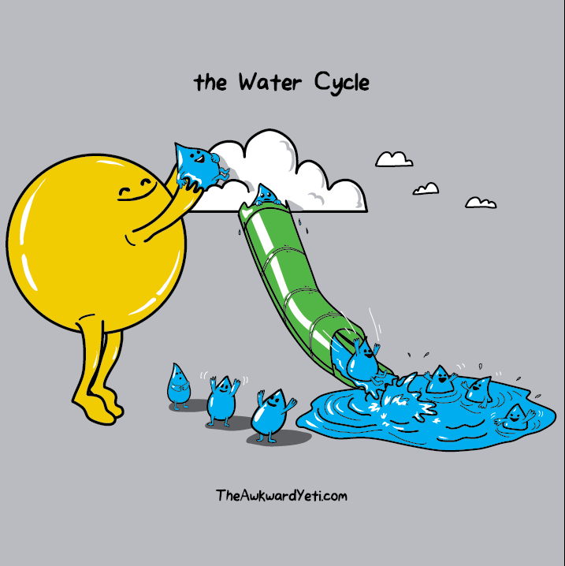

```{r setup, include=FALSE}
knitr::opts_chunk$set(echo = TRUE)
```




#  Mathematical Representation of this model 

Precipitation = Evapotranspiration + Change in Storage

P = ET + ΔS

(at global scales ΔS includes streamflow since that water is still “stored” in the earth)

Water balance can tell you a lot


---

#  Models for understanding(big #’s, little #’s as controls on phenomena) 

Questions

In a particular place (Baltimore Harbor), would temperature often be a limiting factor in eutrophication?
At what times of year, would N-export matter more or less?


[US EPA Source](http://www.newworldencyclopedia.org/entry/File:Eutrophication.jpg)

---

#  Models for estimation and what if scenarios 

[IPCCProjections](http://narccap.ucar.edu/about/figures/IPCCProjections.jpg)

Estimate of global temperatures over the next 100 years


---

#  Models for estimation 


[Estimate of energy savings from LED adoption](http://www.lightnowblog.com/2014/10/forecasted-energy-savings-from-led-lighting/)

---

# Modeling for Problem Solving in Environmental Science

* There is something you need to know in order to solve the problem

  * Answer to a question
  
      * What if?
      * How Much?
      * Which Alternative?
      * Why is this happening?
      
  * Test a Hypothesis
  
---  

# Modeling for Problem Solving in Environmental Science

* Always start by clearly defining your goal as a questions (or hypothesis to be tested)

* Examples?

---

#  Models can also be for communication Example:Glaciers 

Goal: Help public understand why, even if temperature warms - glaciers might grow (due to increasing snowfall) - but a threshold temperature might be reached where glacier will shrink

[Glacier model](https://phet.colorado.edu/sims/cheerpj/glaciers/latest/glaciers.html?simulation=glaciers)


---

#  Model Goals 

*Understanding* (how does something work, what are key drivers of responses, how do different drivers interact)

*Estimation/Scenario* (what might be the consequences of decisions we make about the environment)

*Communication* - contribute to education and broader understanding

---

#  Basic components of models 

**Inputs** : Varying; think *x* of a *x* vs. *y* regression

**Parameters** : single values that influence relationships in the model

**Outputs** : what you want to estimate

---

#  Simple model 

**Input** : Change in unemployment rate

**Output** : Change in GDP

**Parameters** : Slope and intercept of the line

The US "changes in unemployment – GDP growth" regression with the 95% confidence bands.


---

#  STEPS: Modeling for Problem Solving in  ES 

Clearly define your goal (a question you want to answer, hypothesis you want to test, prediction you want to make) - as precisely as possible

* Design or Select your model

* Implement the model

* Evaluate the model and quantify uncertainty

* Apply the model to the goal

* Communicate model results

---

#  Goals 

The goal will help you to define the core pieces of a model

Often helpful to start at the end: Outputs


Problem: which piece of land should be purchased to maximize biodiversity?

Outputs:
monetary costs and benefits of different options in 2015 dollars, including “non-market” benefits

---

# Goals 

The goal will help you to define the core pieces of a model

Often helpful to start at the end: Outputs

Problem: how will forest carbon sequestration change if fire frequency increases with warming

Outputs
carbon sequestration for different fire frequencies

---

# Exercise 

In groups, brainstorm about models that you are familiar with (or could imagine!); provide an example of

a model for estimation

a model for communication

a model for understanding

For each one -
Briefly describe a goal for the model - be as specific as you can

Add your description to the gauchospace forum 
*Examples of Models for Estimation, Communication or Understanding*


# Prepare for Wednesday Lecture

* Fill out *Help us get to know you* survey on Gauchospace

* Listen to *only* timestap 26:27 to 31:22  (basically 5 minutes) of the following 
blog by Lisa Felman Barrett - a highly cited psychologist

* [blog  26:27 to 31:22](https://www.youtube.com/watch?v=NbdRIVCBqNI)

[More about Lisa Felman Barrett](https://www.affective-science.org/lisa-feldman-barrett.shtml)

After listening, think of a model that you are internally using to solve the inverse inference problem. 

Pick a model  related in some way to your interest in the environment?

Describe this in 2-3 sentences and add to Gauchospace under the following forum

*Examples of Internal models to solve the inverse inference problem*
