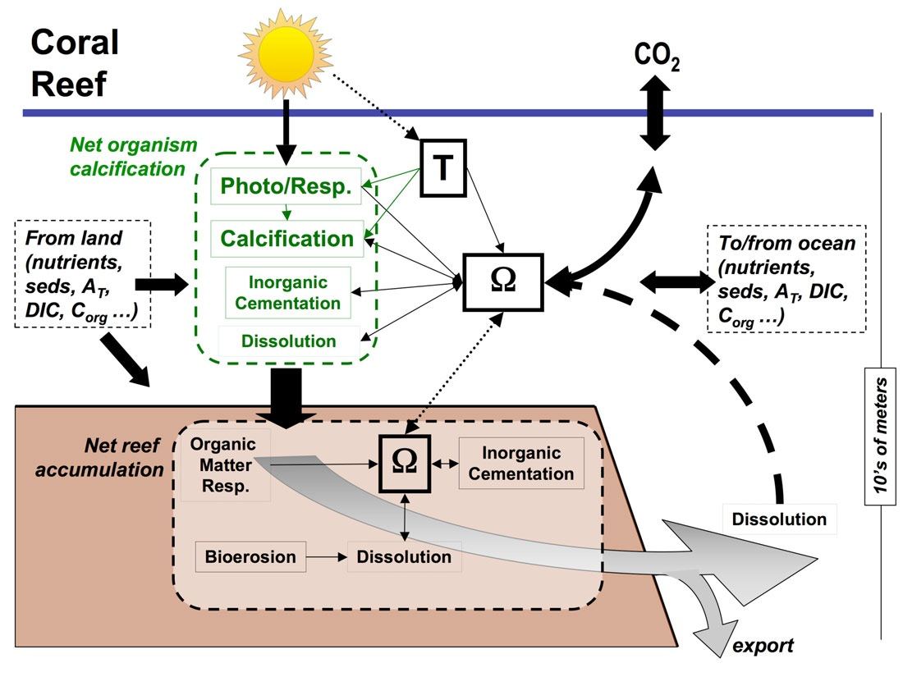

# What is a model


* understanding

* prediction

* communication

You are doing this all the time - there are many reasons to make this process explicit (computer aided modeling)


```{r, out.width = "75%",out.height="75%", echo=FALSE}
knitr::include_graphics("lecture2.conceptual.simple/assets/img/model_basic.001.jpeg")
```
---

#  Basic components of models 


Inputs: Varying; think x of a x vs y regression

Parameters: single values that influence relationships in the model

Transfer Function (model): Equations that transfer inputs to outputs given parameters

Outputs: what you want to estimate


---

# What's in the box

  * What are the processes/relationships that you think are important to translate inputs to output

  * Transfer function (mathematical representation)

  * Parameters, values that influences how the model relationships work

  * There are often multiple "boxes" internal to a model
  
---


#  What’s in the box 

Often more complicated than a simple regression…

So we need to think through what the relationships are; the processes are that we want to take in to account

Conceptual models are a good place to start

---

#  Conceptual models of the hydrologic cycle 

Precipitation = Evapotranspiration + Change in Storage

P = ET + ΔS

(at global scales ΔS includes streamflow since that water is still “stored” in the earth

```{r, out.width = "75%",out.height="75%", echo=FALSE}
knitr::include_graphics("lecture2.conceptual.simple/assets/img/image6.png")
```

---

# Conceptual Hydrology Model - more complex, multiple boxes 

Goal - estimate streamflow fromm multiple source (surface and subsurface)


```{r, out.width = "25%",out.height="25%", echo=FALSE}
knitr::include_graphics("lecture2.conceptual.simple/assets/img/image7.png")
```

```{r, out.width = "75%",out.height="75%", echo=FALSE}
knitr::include_graphics("lecture2.conceptual.simple/assets/img/image8.png")
```

---

#  SERI-Fire 

* More complex model couple sub-models

* How do ecological and human factors interact to influence fire regimes 


```{r, out.width = "75%",out.height="75%", echo=FALSE}
knitr::include_graphics("lecture2.conceptual.simple/assets/img/image9.png")
```

---


# Types of Model

There are many different ways to classify models

A *useful* classification looks at how models deal with space, time, and process 

Useful because the *type* of model will have implications for how you *build* and *use/run* the model

---

#  Stochastic - Deterministic 

Stochastic:  Model output is the probability of flood events of a magnitude greater than 500 m3/sec given rainfall probability distribution (artificial or generated from data) for a 100km2 watershed
Deterministic: Model output is the depth of flood given a rainfall event of 10cm over a 100km2 watershed

[source](http://www.vertex42.com/ExcelArticles/mc/MonteCarloSimulation.html)


---

#  Lumped …Spatially distributed 

Lumped - single point in space, or space doesn’t matter

Spatially distributed - model is applied to different “patches” in space
spatial units are independent

spatial units interact with each other

[source](http://eo.ucar.edu/staff/rrussell/climate/modeling/climate_model_resolution.html)


---

#  Static- Dynamic Time Varying 

Static - Processes or Variables modeled do not evolve with time

Dynamic - model elements evolve through time - and variables/results at one time step typically depends on previous time step

[source](http://www.econometricsbysimulation.com/2013/05/sir-model-flue-season-dynamic.html)

```{r, out.width = "75%",out.height="75%", echo=FALSE}
knitr::include_graphics("lecture2.conceptual.simple/assets/img/image13.png")
```


---

#  Abstract - Physically/Process based 

Abstract - relationship between inputs and output depends on parameters that don’t necessarily have a physical meaning

Physically based - parameters do have a physical meaning (could be measured) - relationships derived from first principles (theory) of how things work

---

#  Abstract - Physically/Process based 

serc.carlton.edu
Abstract

Physically based


```{r, out.width = "75%",out.height="75%", echo=FALSE}
knitr::include_graphics("lecture2.conceptual.simple/assets/img/image4.jpeg")
```


```{r, out.width = "75%",out.height="75%", echo=FALSE}

```


[Abstract](http://serc.carlton.edu)
[Physically based](http://ks.water.usgs.gov/pubs/reports/paclim99.html)
[http://ks.water.usgs.gov/pubs/reports/paclim99.html](http://serc.carlton.edu)

---

#  Conceptual models: Composing 

Pictorial representation of how you think about your system, and what needs to be included in 
the model to answer your questions (or achieve your modelling goal)

There are many software tools available for generating conceptual models, I like


[Diagrams.net]{https://www.diagrams.net/}

---

# Conceptual model design

Some model designers uses standard symbols for the different model components 


Building Models


---

#  • PhD of Norman Crawford under supervision of Ray K Linsley at Stanford University in 1962 

Conceptual Models


---


---

---
#  From conceptual model to flow chart/workflow 

Impact of smoke from fires on health of agricultural workers
What is ‘smoke”
What is “health”
What is an “agricultural worker”. …leads to your conceptual model

---
---
#  Design/Selecting Models 

```{r, out.width = "75%",out.height="75%", echo=FALSE}
knitr::include_graphics("lecture2.conceptual.simple/assets/img/model_basic.001.jpeg")
```

* What are your inputs-outputs

* What’s in the box (the model itself) that gives you a relationship between outputs and inputs

* Transfer function

* Parameters, values that influences how the model relationships work

---
#  Types of Models

Conceptual.............Mathematical

Stochastic.............Deterministic

Lumped.............Spatially Distributed: *SPACE*

Static.............Dynamic  : *TIME*

Abstract.............Physically/Process Based

but biggest differences may often be the degree specific processes/parameters are accounted for

---

#  Types of models: Example 

* Input: Reservoir height (height) and flow rate (flow)
* Output: Instantaneous power generation (W/s)

* Parameter: Reservoir Efficiency (K)

Conceptual model

```{r, out.width = "75%",out.height="75%", echo=FALSE}
knitr::include_graphics("lecture3_conceptualmodels2/assets/img/reservoir_cm.001.jpeg")
```

---

#  Types of models: Example 

* **Input**: Reservoir height and flow rate

* **Output**: Instantaneous power generation (W/s)

* **Parameters**: K Efficiency , ρ (density of water), g (acceleration due to gravity)

P = ρ * h * r * g * K Efficiency;

P is Power in watts, ρ is the density of water (~1000 kg/m3), h is height in meters, r is flow rate in cubic meters per second, g is acceleration due to gravity of 9.8 m/s2, K Efficiency is a coefficient of efficiency ranging from 0 to 1.

This is a static (one point in time), deterministic, lumped (one place) model; its more or less physically based

---
#  Types of models: Example 

If we expand the model to compute power production over a year, where inputs were streamflow into the reservoir - *Dynamic Model*

If we expand to model power production from all the reservoirs in California, accounting for spatial patterns of snowmelt inputs and upstream-downstream relationships - *Spatially Distributed Model*

If we modified the model to estimate the probability distribution of power production, given a probability distribution of reservoir levels  - *Stochastic Model*

---
#  STEPS: Modeling for Problem Solving in  ES 

* Clearly define your goal (question you want to answer, hypothesis you want to test, prediction you want to make) - as precisely as possible

* Develop a conceptual model - draw it!

* <span style="color: red;">Design</span> or Select your model

* <span style="color: red;">Implement the model</span>

* Evaluate the model and quantify uncertainty

* Apply the model to the goal

* Communicate model results

---
#  Steps for Design and Implement your model 

* Design conceptual model

* Translate conceptual model into a mathematical representation

* Choose programming language

* Define inputs (data type, units)

* Define output (data type, units)

* Define model structure

* Write model

* Document the model  (meta data)

* Test model


#  Assignment 2

Your goal is to develop a conceptual model of almond yield  - the goal will be able to predict how almond yields might change if seasonal precipitation or air temperature patterns change in California

The Lobell et al. 2006 paper will be the source for your model; specifically look at the equations in table 2.

* List what the inputs and outputs will be - think carefully about time scale and units for inputs and output

* Draw a conceptual model to represent your model that will translate inputs to output, on your diagram list what your inputs and outputs are with units

* For a challenge - think about how you might change your conceptual model so that it would work for all tree yields considered by the Lobell paper

We will build on this on Thursday's class so make sure you've completed before then


