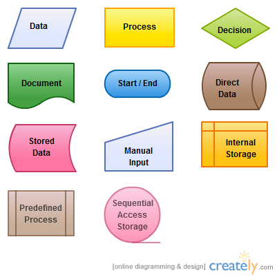
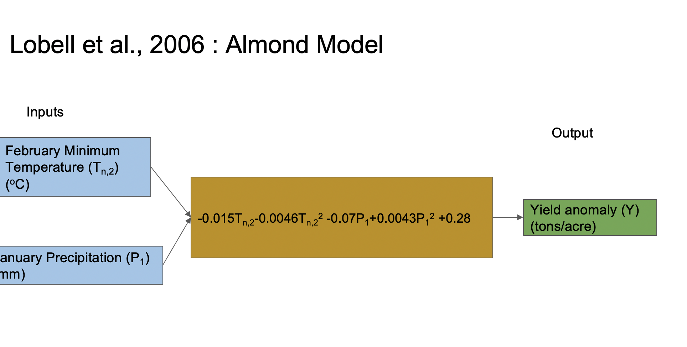

#  Steps for Design and Implement your model 

* Design conceptual model

* Translate conceptual model into a mathematical representation

* Choose programming language

* Define inputs (data type, units)

* Define output (data type, units)

* Define model structure

* Write model

* Document the model  (meta data)

* Test model

#  What’s in the box 

Often more complicated than a simple regression…

So we need to think through steps are - what is connected with what

Diagrams are a good place to start


#  Modularity - Discrete Tasks  

Hierarchical in level of details

Big chunks (coarse detail) -> progressively finer

Note ‘tasks’ that need to be repeated

All tasks should have inputs and outputs

```{r, out.width = "75%",out.height="75%", echo=FALSE}
knitr::include_graphics("lecture2.conceptual.simple/assets/img/model_basic.001.jpeg")
```


# Model design flowcharts

Some model designers uses standard symbols for the different model components 


Building Models



#  • PhD of Norman Crawford under supervision of Ray K Linsley at Stanford University in 1962 

Conceptual Models


#   Composing Diagrams

Pictorial representation of how you think about your system, and what needs to be included in 
the model to answer your questions (or achieve your modelling goal)

There are many software tools available for generating conceptual models, I like


[Diagrams.net]{https://www.diagrams.net/}


#  SERI-Fire 

* More complex model couple sub-models

* How do ecological and human factors interact to influence fire regimes 


```{r, out.width = "75%",out.height="75%", echo=FALSE}
knitr::include_graphics("lecture2.conceptual.simple/assets/img/image9.png")
```


#  From conceptual model to flow chart/workflow 

Impact of climate on almond productivity

What is almond productivity?

What is climate?


```{r, out.width = "75%",out.height="75%", echo=FALSE}

```


```{r, out.width = "75%",out.height="75%", echo=FALSE}
knitr::include_graphics("lecture4_building_models/assets/img/fuller_almond_CM.jpeg")
```
 
 

```{r, out.width = "75%",out.height="75%", echo=FALSE}
knitr::include_graphics("lecture4_building_models/assets/img/more_general_almond_CM.jpeg")
```


#  Building Models 

Functions!

The basic building blocks of models

Functions can be written in all languages; in many languages (object-oriented) like C++, Python, functions are also objects

Functions are the “boxes” of the model - the transfer function that takes inputs and returns outputs

More complex models - made up of multiple functions; and nested functions (and main functions that call/user other functions and control the flow - the arrows between boxes)


#  Functions 

Decide on 

 * Inputs and parameters

  * Outputs

Data types, units (time and space aggregation), names should be (use descriptive names)


#  Functions 

## Simple

* input (mean growing season temperature - growT); 

* parameter (senT - sensitivity to temperature

* output (growth )

(all float)

## More complex

* inputs (temperature (growT), Plant type)

* parameters 
     * sensT (array of temperature sensitivities for different plant types), 
    * growingmonths (array of growing season months for differnt plant types)

* output ( growth)


**IMPORTANT**

Place each function in its own file (x.R), and put all functions for a given project in *R* subdirectory


#   Example 

```{r, out.width = "75%",out.height="75%", echo=FALSE}
knitr::include_graphics("lecture3_conceptualmodels2/assets/img/reservoir_cm.001.jpeg")
```

* Input: Reservoir height (height) and flow rate (flow)

* Output: Instantaneous power generation (W/s)

* Parameters: K Efficiency , ρ (density of water), g (acceleration due to gravity)

P = ρ * h * r * g * K Efficiency;

P is Power in watts, ρ is the density of water (~1000 kg/m3), h is height in meters, r is flow rate in cubic meters per second, g is acceleration due to gravity of 9.8 m/s2, K Efficiency is a coefficient of efficiency ranging from 0 to 1.

This is a static (one point in time), deterministic, lumped (one place) model; its more or less physically based


#  Building Models 

Inputs/parameters are height, flow, rho, g, and K

For some (particularly parameters) we provide default values by assigning them a value (e.g Keff = 0.8), but we can overwrite these

Body is the equations between { and }
*return* tells R what the output is

```{r eval=TRUE}
library(tidyverse)
power_gen = function(height, flow, rho=1000, g=9.8, Keff=0.8) {

result = rho * height * flow * g * Keff
return(result)
}

power_gen(height=10, flow=2)
power_gen(10,2)
power_gen(10,2, g=4.2)

# generate some test data
measured_height=runif(min=1, max=100, n=20)

# create a data frame to store results of model run
power_estimate = cbind.data.frame(height=measured_height, estimate=power_gen(height=measured_height, flow=2))

# graph
ggplot(power_estimate,aes(height, estimate) )+geom_point()+labs(y="power in W/x", x="height (m)")
```


```{r eval=TRUE, echo=TRUE}
#' Power Generation
#'
#' This function computes instantaneous power generation
#’ from a reservoir given its height and flow rate into turbines
#' @param rho Density of water (kg/m3) Default is 1000
#' @param g Acceleration due to gravity (m/sec2) Default is 9.8
#' @param Kefficiency Turbine Efficiency (0-1) Default is 0.8
#' @param height height of water in reservoir (m)
#' @param flow flow rate (m3/sec)
#' @author Naomi
#' @examples power_gen(20, 1)
#' @return Power generation (W/s)


power_gen = function(height, flow, rho=1000, g=9.8, Keff=0.8) {

 

  # calculate power
    result = rho * height * (flow) * g * Keff


  return(result)
}
```

# Sharing Example R, Data and Rmarkdowns

[esm232_examples github site]{https://github.com/naomitague/ESM232_Examples.git} 

You can clone this repository and then pull before class to get example code and data

Just remember that git does not like having nest repositories - so
keep working respoistories in separate directories


