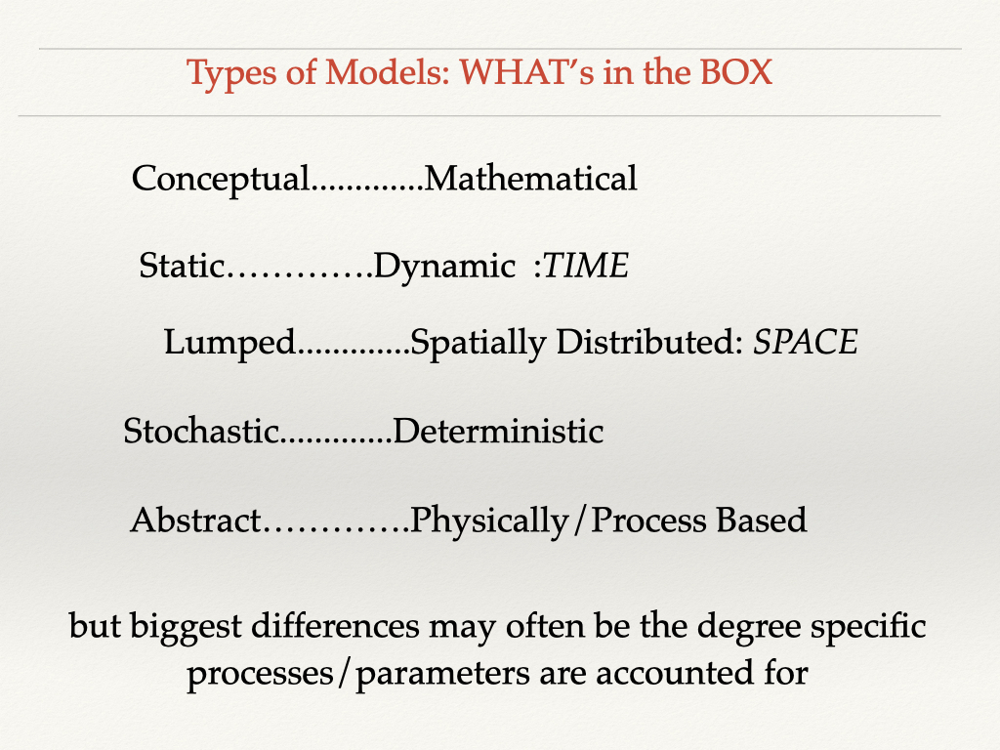
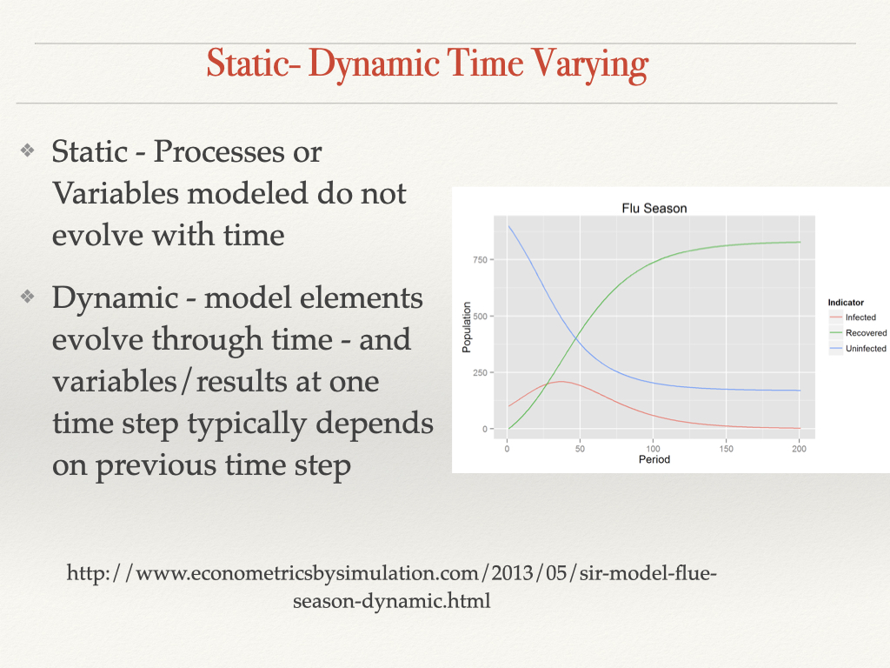
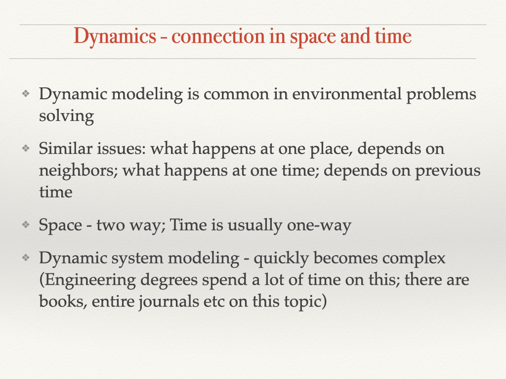
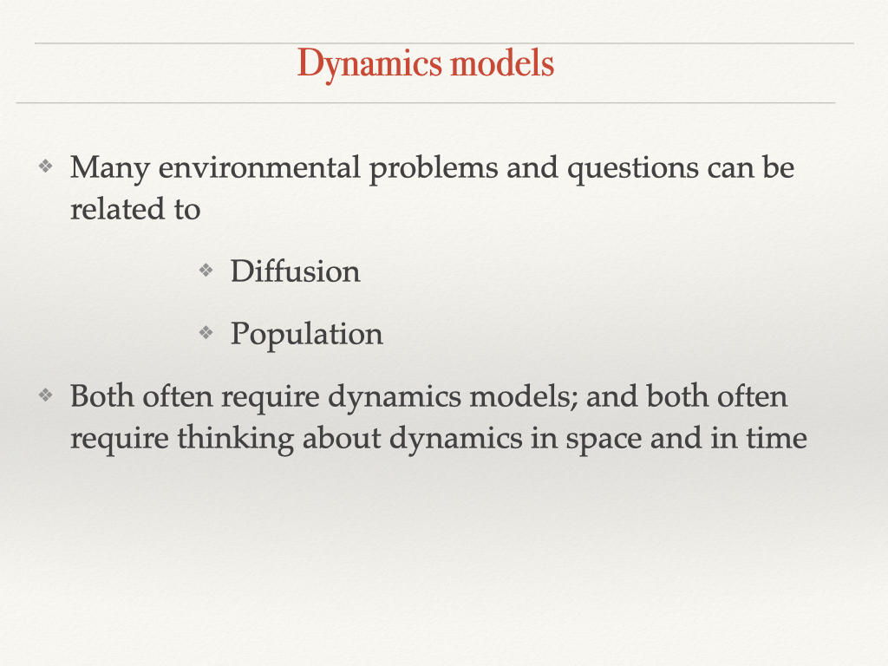
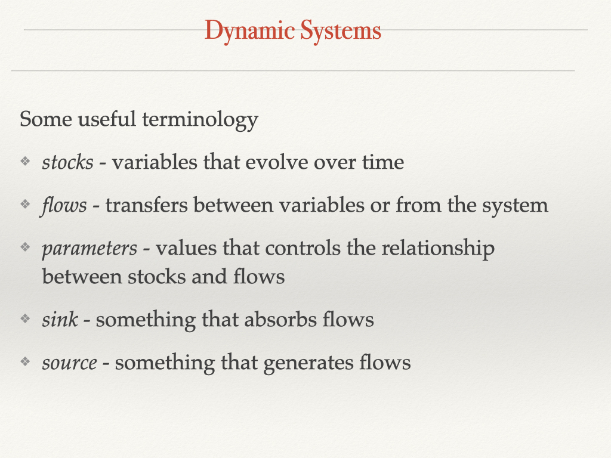
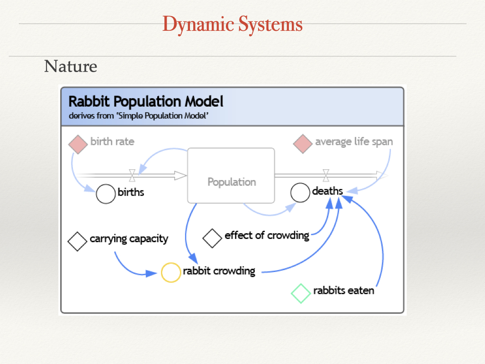
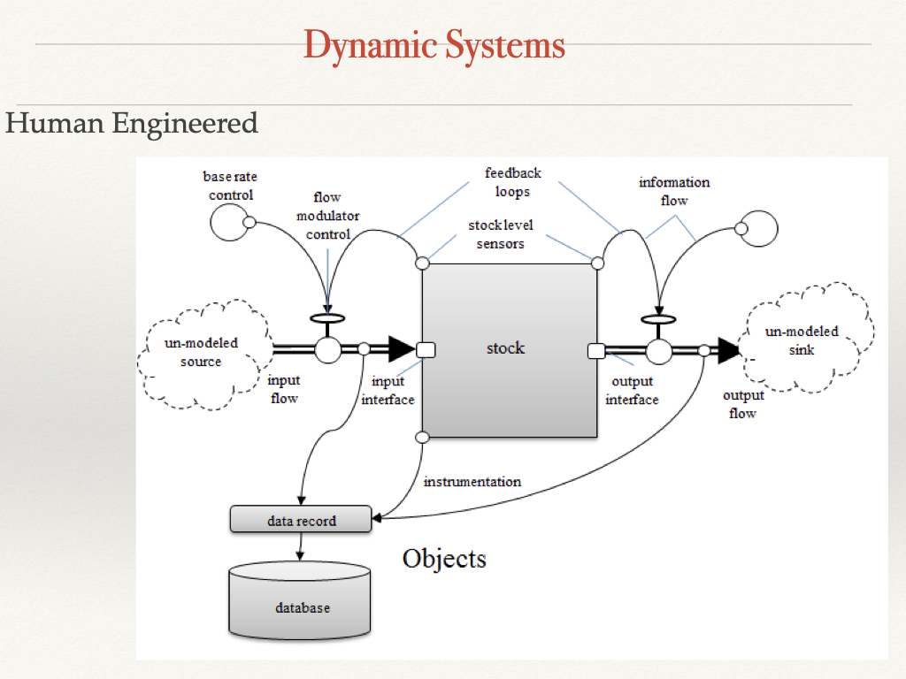

```{r setup, include=FALSE}
knitr::opts_chunk$set(echo = TRUE)
library(tidyverse)
library(purrr)
library(deSolve)
```

# Return to big picture - model types


---

# Dynamic Models


---

# Spatial models that interact - similar to dynamic

* Key idea is dependency from one point in time/space to the next!

* This implies a differential/difference equation to describe the process/transfer function


---

# Dynamic modeling


---

# Why you should care


---

# Vocab




---

# Examples - note the feedback loops (time dependency)


---

---

# Feekback is a key feature of dynamic models


* dynamic systems often have *feedbak* loops
  * positive 
  * negative
  
* feedbacks often lead to non-linear responses 
  * think "runaway" growth
  
#  Discrete vs Continuous

* do we break time/space in to "chunks" *discrete*

* or think of time/space as a stream. *continuous*

Discrete might be modeling something that occurs once every period; water withdrawls,
tax revenues

Continuous would be things like pollution, water that are always changing in time

Discrete models for dynamic processes use *difference* equations
Continuous models for dynamic processes use *differential* equations

Often it depends on how you look at the system - 


---

# Dynamic System

Initial conditions

* to model how something evolves over space and time
  * you need to know where it starts from
  
  * setting initial conditions is usually part of dynamic modellinng
  
Boundary Value Problems

* especially for spatial dynamic models sometimes initial conditions are provided
values at "end points" 


# Stability

Dynamic systems may lead to *unstable* or *stable* or *cyclic* states over time

* stable...output converges to a particular over time, or for *cyclic* a 
repeated patterns of values

* unstable ...grows to infinity

* *chaotic* ..highly sensitive to initial conditions


* for the same dynamic systems whether you are stable can change with parameters and initial conditions


# Simple Example


---

---

---

---

---

---

# Implementing Dynamic Models in R

Dynamic models always involves derivatives (equations that express how things change from time step to time step or place to place )


Implement population growth as a derivative - a model of population change

```{r derivaties, echo=TRUE}
# note that we include time here but we don't use it; we will need this later
source("../R/dexppop.R")

dexppop
# see how it works
dexppop(P = 20, r = 0.01)


# what is this?

# notices this is the same as
dexppop(t = 100, P = 20, r = 0.01)

# lets look at this for a range of initial populations
pops <- seq(from = 1, to = 100)
tmp <- pops %>% map(~ dexppop(time = 0, r = 0.01, P = .x))
pchange <- unlist(tmp)


pdyn <- data.frame(pops, pchange)
ggplot(pdyn, aes(pops, pchange)) +
  geom_point(col = "green", size = 1.5)


# why is this a straight line?
# how many new individuals are born at each population level

# try this - add a carrying capacity (dP/dt = 0 if P > carryingcapacity)
```


# Integration

What if we wanted to look at population in 20 years given an initial condition

Two options

* explicit solution to differential equation is known; e.g. you can integrate both sides of the equation! Not always possible but lets look at a case where it is possible

* must be solved by iteration; this is what we do when we can't integrate both sides 

# Explicit Solution is available

```{r explicit}
source("../R/exppop.R")

exppop

# gives population after any time given an initial population

# 20 rabbits, growth rate of 0.01 how many in 30 years
exppop(T = 30, P0 = 20, r = 0.01, K = 1000)

# if we want to see how population evolves over time - generate a time series by running our model for each point in time

initialrabbits <- 20
years <- seq(from = 1, to = 100, by = 2)
Ptime <- years %>% map_dbl(~ exppop(P0 = initialrabbits, r = 0.01, K = 1000, T = .x))

# keep track of what times we ran
Ptime <- data.frame(P = Ptime, years = years)

ggplot(Ptime, aes(years, P)) +
  geom_point() +
  labs(x = "years", y = "Rabbit Population")

# try generating results for maximum and minimum possible r values to compare (guess at what you think)


max_r <- 0.1
min_r <- 0.01
K <- 1000

tmp <- years %>% map_dbl(~ exppop(r = max_r, P0 = initialrabbits, K = K, T = .x))
Ptime$Pmaxr <- tmp
tmp <- years %>% map_dbl(~ exppop(r = min_r, P0 = initialrabbits, K = K, T = .x))
Ptime$Pminr <- tmp

head(Ptime)
Ptimep <- Ptime %>% gather(key = "r", value = "P", -years)
ggplot(Ptimep, aes(years, P, col = r)) +
  geom_point() +
  labs(x = "years", y = "Rabbit Population")

# notice how population becomes unstable for high growth rates!
```
# Integration

What if we wanted to look at population in 20 years given an initial condition

Two options

* explicit solution to differential equation is known; e.g. you can integrate both sides of the equation! Not always possible but lets look at a case where it is possible

* must be solved by iteration; this is what we do when we can't integrate both sides 
# What if no analytical solutions is available

# Example 

Continue looking at our rabbit population but we can't solve it..

* iterate through time

* calculate rate of change at initial conditions (e.g value of differential 
equation for initial conditions)

* add that value to initial conditions, to create state at time t + 1

* re-calculate rate of change (e.g value of differential equation for
state at time t+1)

* keep doing this

Key questions is how much of a "jump" in t do we do

If you do this you are "kind of"  turning the differential equation into a difference equation

# Solving by thinking of problem as a difference equations

Population models can be discrete (rather than continuous)

So we could implement them as difference equations and iterate


```{r iterate1}
source("../R/discrete_logistic_popK.R")
# notice how a for loop is used to iterate

# how many rabbits after 50 years given a growth of 0.1
# starting with 1 rabbit - but a carrying capcity of 500

discrete_logistic_pop

discrete_logistic_pop(P0 = 1, r = 0.05, K = 200, T = 50)

# save results
discrete_result <- discrete_logistic_pop(P0 = 1, r = 0.05, K = 200, T = 50)

# lets also keep the parameters for use later
P0 <- 1
r <- 0.05
K <- 200
T <- 50
```

# Compare discrete and analytic results

Save the results from both to compare


```{r closed}
source("../R/exppop.R")

exppop(P0 = P0, r = r, K = K, T = T)
analytic_result <- exppop(P0 = P0, r = r, K = K, T = T)

analytic_result
discrete_result

# why are they different
# look at trajectories

growth_result <- data.frame(time = seq(from = 1, to = 100))

growth_result$Panalytic <- growth_result$time %>% map_dbl(~ exppop(P0 = 1, r = 0.05, K = 200, T = .x))

growth_result$Pdiscrete <- growth_result$time %>% map_dbl(~ discrete_logistic_pop(P0 = 1, r = 0.05, K = 200, T = .x))

tmp <- growth_result %>% gather(key = "Ptype", value = "P", -time)
ggplot(tmp, aes(time, P, col = Ptype)) +
  geom_point()

# try running them for longer time periods to see what happens
# change the value of r, K , P0 - see how it effects the results
```


# Solving using numeric integration 

Using a solver....when you can't do the integration by hand :)


Solvers integrate by iteration but doing so in a way 
that more closely *approximates* analytic integration

Use mathematical tricks to deal with the fact that the rate of change keeps changing :)

There are different types of *solvers*, some work better than others depending on
the form of the derivative

# Numerical integration with ODE

Implement the differential equation as a function that

* returns the derivative (as a list)

* inputs time, the variable(s) and a parameter list

(it needs time even though you don’t use it)

My convention: name derivative functions starting with *d* to remind myself that they are computing a derivative

# ODE

Only works for Ordinary Differential Equations - single independent variable (in our case time)

Partial differential equations - more than 1 independent variable (e.g x and y if changing in space)

R has a solver called *ODE* for solving ordinary differential equations from package **desolve**

# *ODE* requires

* initial conditions
* values of independent where we want values of dependent variable (e.g times where we want population)
* the derivative as a function
* a list that contains all  parameter values (or if you have only one parameter then you can use a single value)

# ODE example
```{r usingode}
source("../R/dexppop.R")

dexppop
library(deSolve)
initialrabbits <- 20
years <- seq(from = 1, to = 100, by = 2)

# run the solver
Ptime <- ode(y = initialrabbits, times = years, func = dexppop, parms = c(0.01))
head(Ptime)
colnames(Ptime) <- c("year", "P")

# notice that there are additional pieces of information year, including the method used for integration
attributes(Ptime)

# this also means you need to extract just the data frame for plotting
ggplot(as.data.frame(Ptime), aes(year, P)) +
  geom_point() +
  labs(y = "Population", "years")

# this also works (of course function can be by order)
Ptime <- ode(initialrabbits, years, dexppop, 0.03)
colnames(Ptime) <- c("year", "P")
ggplot(as.data.frame(Ptime), aes(year, P)) +
  geom_point() +
  labs(y = "Population", "years")
```

# *Homework*

Try to modify *dexppop* so that it includes carrying capacity and compare with what we did for our analytic and then discrete ways of doing this

