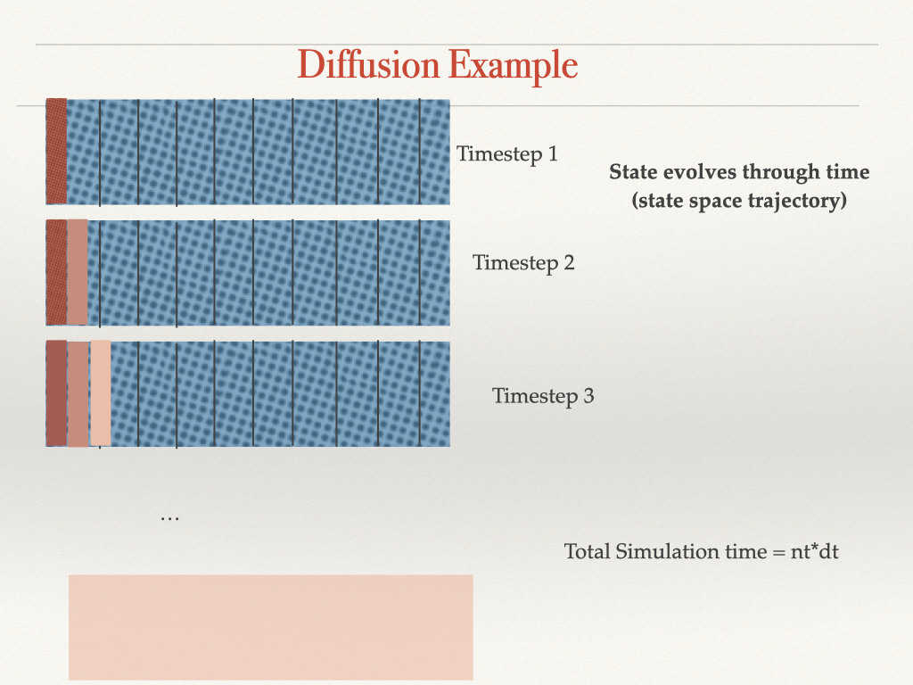

```{r setup, include=FALSE}
knitr::opts_chunk$set(echo = TRUE)
library(tidyverse)
library(deSolve)
```
# Using the ODE solver


To integrate a differential equation using ODE solve
Needs

*initial conditions

*differential equation

*parameters


# Additional parameters 


to work with ODE,
parameters must all be input as a single list; similar to how we return multiple outputs from a function

see example below..lets add a carrying capacity

# R code with carrying capacity

```{r exampleode}
library(deSolve)


source("../R/dexppop_play.R")

dexppop_play

# create parameter list
initalrabbits <- 2
years <- seq(from = 1, to = 100, by = 2)

newparms <- list(r = 0.03, carry_capacity = 300)

# apply solver
results <- ode(initalrabbits, years, dexppop_play, newparms)
head(results)

# add more meaningful names
colnames(results) <- c("year", "P")

# plot
ggplot(as.data.frame(results), aes(year, P)) +
  geom_point() +
  labs(y = "Population", "years")
```


# Try again with different parameters

```{r exampleode2}
# same initial condtions
initalrabbits <- 2
years <- seq(from = 1, to = 100, by = 2)

# try again with different parameters
alternativeparms <- list(r = 0.04, carry_capacity = 500)
results2 <- ode(initalrabbits, years, dexppop_play, alternativeparms)


# look at results
head(results2)
colnames(results2) <- c("year", "P_parm2")

# plot
ggplot(as.data.frame(results2), aes(year, P_parm2)) +
  geom_point() +
  labs(y = "Population", "years")

# compare by combining into a single data frame
both <- inner_join(as.data.frame(results), as.data.frame(results2))

both_p <- both %>% gather(key = "model", value = "P", -year)
ggplot(both_p, aes(year, P, col = model)) +
  geom_point() +
  labs(y = "Population", "years")
```


# Differential Equation, Difference (Iteration by hand) comparison

Remember we have 3 ways now to calculate population

analytical solution - based on integration (exppop.R) BEST

using an ode solver for numerical approximation (exppop_play.R)

numerical integration using in discrete steps (discrete_logistic_pop.R)


```{r, compare}
# lets also keep the parameters for use later
P0 <- 2
r <- 0.05
K <- 200


# get all models
# discrete
source("../R/discrete_logistic_popK.R")
# analytic
source("../R/exppop.R")
# differential for ode
source("../R/dexppop_play.R")


# create times we want to see results for
growth_result <- data.frame(time = seq(from = 1, to = 100))

growth_result$Panalytic <- growth_result$time %>% map_dbl(~ exppop(P0 = P0, r = r, K = K, T = .x))

growth_result$Pdiscrete <- growth_result$time %>% map_dbl(~ discrete_logistic_pop(P0 = P0, r = r, K = K, T = .x))


# set up using the same parameters
pcompare <- list(r = r, carry_capacity = K)
# now run our ODE solver
result <- ode(P0, growth_result$time, dexppop_play, pcompare)
head(result)

# we already have time - so just extract population
growth_result$Pdifferential <- result[, 2]

# compare all 3 approaches
tmp <- growth_result %>% pivot_longer(cols = -time, names_to = "Ptype", values_to = "P")
ggplot(tmp, aes(time, P, col = Ptype)) +
  geom_point()

# notice Pdifferential is closer to Panalytic than Pdiscrete
```

# Other Examples

All differential and difference equations are approximations
The analytical solution is exact

Notice that differential equations is a bit more accurate!

# Lets look at something a bit more complicated

* diffusion (how a contaminent moves through space and time)
* start with 1 dimension in space

# Diffusion Conceptual model


# Modeling Diffusion


Diffusion can be implemented as a partial differential equation 

Complicated to solve - but there are tool in R for specific types of partial differential equations
[Reactive Transport Example](https://cran.r-project.org/web/packages/ReacTran/index.html)

# Sources for more on diffusion

More info on differential equations in R
[online book differential equation in R](http://www-labs.iro.umontreal.ca/~mignotte/IFT2425/Documents/Solving_Differential_Equations_In_R_Soetaert_K.pdf)


# Simple diffusion model

Diffusionn would require partial derivatives - time and space! it gets much more tricky ...beyond this course 

Appoximate diffusion with a difference equation - and iterative to get an estimate of how diffusion works 

Example of Diffusion - difference equation implementation to see what some issues can be


# Diffusion in 1 dimension


# Diffusion in one dimension through time



# Diffusion data structure


# R implementation

```{r}
source("../R/diffusion.R")

# run our diffusion model (iterative difference equation) with initial concentration of 10, for 8 timestep (size 1m), and 10 space steps (size 1s)
# using diffusion parameters 0.5 s/m2, 10 m2
result <- diff1(initialC = 10, nx = 10, dx = 1, nt = 8, dt = 1, D = 0.5, area = 10)

# a list is returned with our 3 data frames for concentration (conc), qin and qout
result

# used filled contour to plot results
head(result$conc)
filled.contour(result$conc, xlab = "Time", ylab = "Distance")

# or if you prefer this orientation (Distance on x axis)
filled.contour(t(result$conc), ylab = "Time", xlab = "Distance")
```

# Change parameters (diffusivity D, and space and time steps (dx, dt))

```{r}
# changes diffusivity and other parameters particularly
# diffusivity, dx and dt
res <- diff1(initialC = 10, nx = 10, dx = 1, nt = 10, dt = 30, D = 0.006, area = 1)

filled.contour(res$conc, xlab = "Time", ylab = "Distance")


# we can also see how much material moved from place to place each time step
filled.contour(res$qin, xlab = "Time", ylab = "Distance")


# play with time step, space step and parameters
```


# Play 

Try running the diffusion model with different time steps, space steps and parameters


# Some examples with different parameters and space/time steps

```{r}
# what if we increase diffusivity
resfast <- diff1(initialC = 10, nx = 10, dx = 0.5, nt = 10, dt = 10, D = 0.08, area = 1)
filled.contour(resfast$conc, xlab = "Time", ylab = "Distance")


# Discretization Issue Example
resunstable <- diff1(initialC = 10, nx = 10, dx = 1, nt = 10, dt = 10, D = 0.8, area = 1)
filled.contour(resunstable$conc, xlab = "Time (fraction of hour)", ylab = "Distance Along Path (m)", main = "Pollutant Diffusion")

# this illustrates the problem with difference equations (and the challenges that methods for numerical integration try to overcome)
# if things are changing quickly we need to use much smaller time, space steps to avoid overshoot and instability

# so lets cut our step size by 10 (dt) (but then add 10 more steps (nx) to cover the same distance)
resunstable <- diff1(initialC = 10, nx = 100, dx = 1, nt = 10, dt = 1, D = 0.8, area = 1)
filled.contour(resunstable$conc, xlab = "time", ylab = "Distance Along Path")
```


