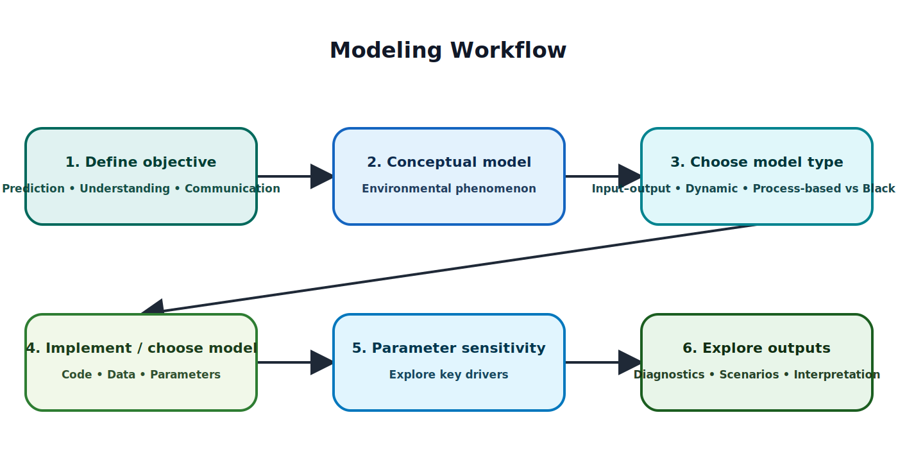
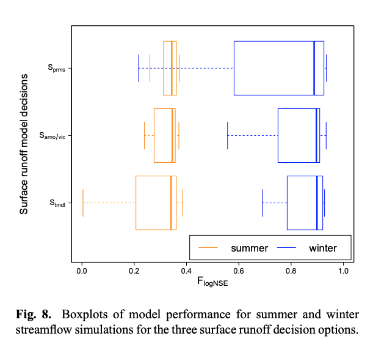
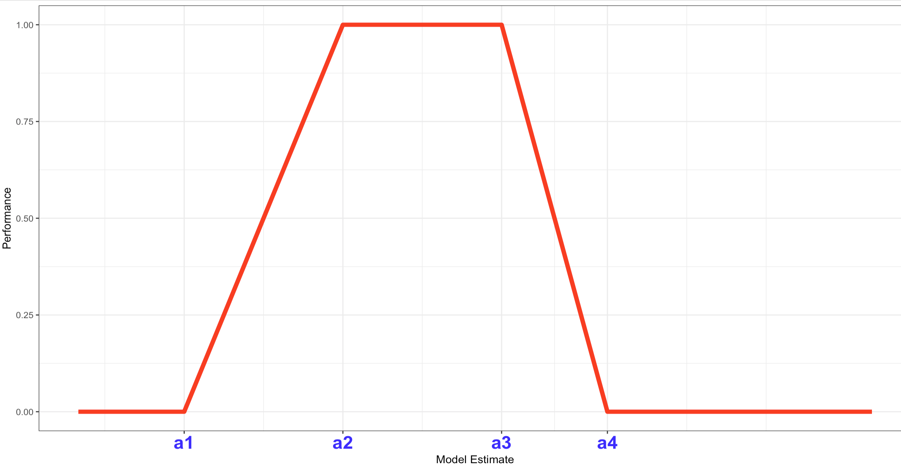
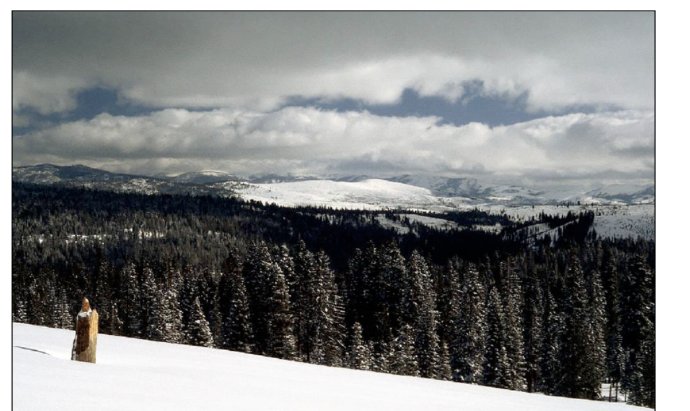
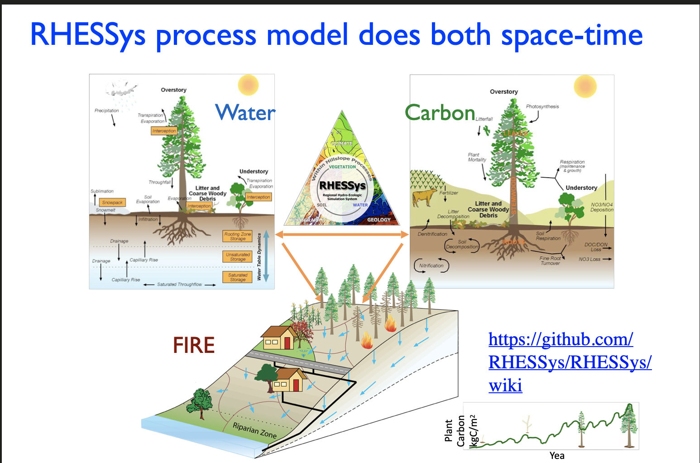
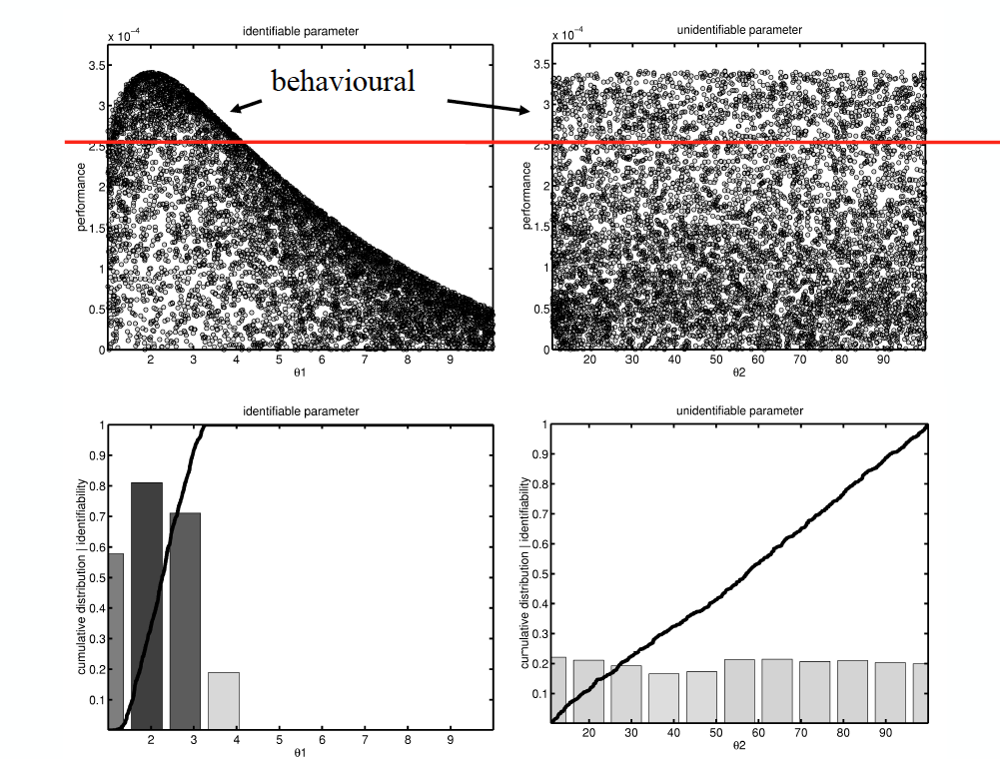
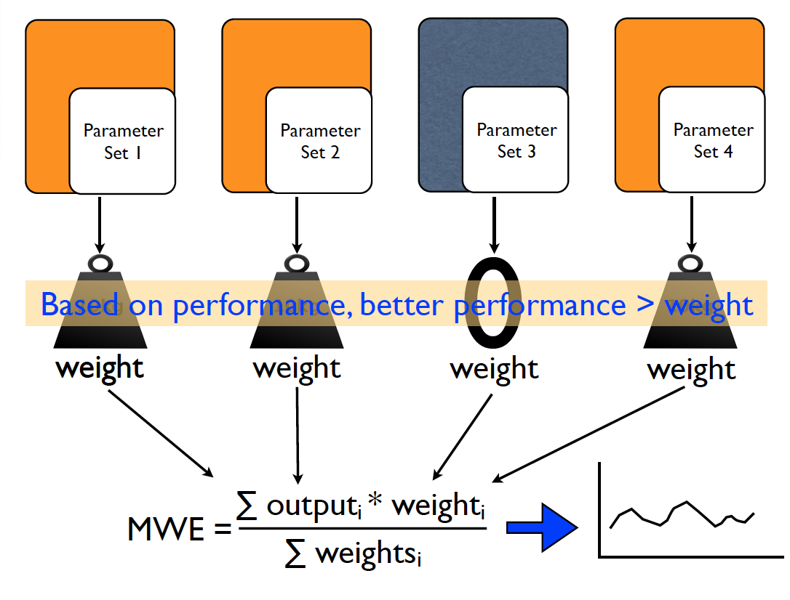

## Some insightful comments from quest lectures {.scrollable}

It's okay to make assumptions, assumptions are in every model.

most models are a great way to describe a system that is fairly unexplained, with the caveat that because it is so underresearched the models developed will have many assumptions. Ultimately, they are still good estimations and starting points to describing a system.

model doesn’t need to be perfect to be useful

Sometimes the model will show you results which contradict what your prior expections would lead you to think.

One insight I gained is that modelling really ecologically complex systems can be broken down into pretty simple but still very meaningful parts.

Know your units and how your system works because the system can be broken down into more handle-able sections in which you can quantify and more easily model.

it's helpful to compare your model with existing frameworks & experts to see whether it aligns or improves on existing models (to compare efficacy). Diagramming each important concept before including into the general model can help provide a sense of uncertainty for each component for considering total variation. Start with existing models and switch out components as necessary (otherwise, you may be connecting many broken pieces instead of starting from the current state of knowledge).s

While simulations use mathemtical framework patterns from 'what-if' scenarios under theoretical conditons, data-driven models extract patterns from historical evidence to forecast future outcomes.

Graded One key insight is that models are most valuable when used alongside field data and not in isolation

each component alone is incomplete, and examining the internals makes clear this isn't the real system. But the model is constructed so that, viewed through the lens of the right question or particular conditions, it is representative of a system's behavior.

You could build the perfect model that predicts outcomes without any error, but if you're not able to explain how it works or why it was built the way it was built, it's not useful at all. Dr. Loheide had almost no equations in his presentation. He explained the entirety of the concept of the model without the granularity.

{width="100%"}

## Comparing Model with Observations

Why?

-   to make a "case" for why you selected this model for your project
-   reduce parameter uncertainty - **Calibration**

## Return to Quiz 3 - Evaluating model {.scrollable}

-   Kelp abundance forecasts (Santa Barbara Channel surveys) Compare predicted kelp biomass to observed survey data using MAE, RMSE, and MSE.

-   Salinity model (Nueces Bay freshwater flow impacts) Compare competing models using AIC based on observed salinity measurements.

-   Coral community (reef transect data) Compare predicted percent coral cover to observed field data using statistical goodness-of-fit testing.

-   Monsoon simulation (observed precipitation and windspeed records) Compare simulated storm outputs to observed meteorological station data using prediction error metrics (e.g., RMSE).

-   Dam impact classification model (observed ecological damage records) Evaluate predicted impact class (low/medium/high) using classification accuracy against observed outcomes.

-   Rainfall prediction model (observed precipitation totals) Compare predicted rainfall to observed rainfall using error metrics and unit consistency checks.

## Calibration and Optimization

What we've already been doing in sensitivity analysis

-   Generate parameter sets (e.g., LHS, sobol)
-   Compute metrics for each results (metrics function)
-   Use sensitivity metrics to find which parameters contribute most to output variation

Calibration - Pick the "best" parameter set - Or pick only parameter sets that perform well

## Quantifying Model Performance {.scrollable}

-   Depends on type of model output

    -   single value (mean energy production from a solar panel)
    -   time series (streamflow, PM10, monthly energy production )
    -   spatial pattern (population, income level)
    -   space-time (pollution in different cites over time, forest biomass growth across different forests)

-   Depends on observations

    -   often not as "dense" as model output (e.g samples)
    -   often you are sampling (e.g mean PM10, mean streamflow) so there is also error/uncertainty in the observation

## Metrics

-   what is possible given available data
-   what is important to get "right" given model application

## Example (Picking model based on performance)



[Staudinger, M., Stahl, K., Seibert, J., Clark, M. P., and Tallaksen, L. M.: Comparison of hydrological model structures based on recession and low flow simulations, Hydrol. Earth Syst. Sci. Discuss., 8, 6833-6866, doi:10.5194/hessd-8-6833-2011, 2011]{style="font-size:50%"}

## Some classic metrics {.scrollable}

-   t.test (are the means different)
-   var.test (are the variances different)

Dynamic models (trends over space and time)

-   RMSE (Root Mean Square Error)
-   Correlation ($R^2$)
-   NSE (Nash-Sutcliffe Efficiency) (variance weighted correlation)

But you can code your own

-   make them an R function for utility

## Percent Error (Relative Bias)

Useful to see if over whole time series you have a bias

Relative Error (%) = $\frac{\bar{m} - \bar{o}}{\bar{o}} \times 100$

``` r
relerr = function(m, o) {
  err = m - o
  meanobs = mean(o)
  return(mean(err) / meanobs)
}
```

## NSE Nash-Sutcliffe Efficiency

-   commonly used in hydrology
-   likes a mean squared error but normalized by the variance of the observations

$NSE = \frac{\sum((m_i - o_i)^2)}{\sum((o_i - mean(o))^2}$

``` r
nse = function(m, o) {
  err = m - o
  meanobs = mean(o)
  mse = sum(err^2)
  ovar = sum((o - meanobs)^2)
  return(1 - mse / ovar)
}
```

## Soft Metrics: Fuzzy Evaluation

-   Handle uncertainty/imprecise/quantitative data
-   Fuzzy membership functions

Many options - here's one example

$perf(x) = \begin{cases}
  0 & \text{if } x \leq a_1 \\
   \frac{x - a_1}{a_2 - a_1} & \text{if } a_1 \leq x < a_2 \\
  1 & \text{if } a_2 \leq x < a_3 \\
  \frac{a_4 - x}{a_4 - a_3} & \text{if } a_3 \leq x < a_4 \\
   0 & \text{if } x \geq a_4
\end{cases}$

[Seibert, J., and J. J. McDonnell, On the dialog between experimentalist and modeler in catchment hydrology: Use of soft data for multicriteria model calibration, Water Resour. Res., 38(11), 1241, doi:10.1029/2001WR000978, 2002]{style="font-size:50%"}

## Fuzzy Metric as a Plot



## Example application {.scrollable}

Lets say our model predicts forest biomass for a 200 year old Ponderosa pine forests in the western US for many sites

Estimating forest biomass is hard and there is a lot of uncertainty in the observations and we don't have estimates for our specific forest - but we know from forest service databases

-   biomass is usually between 100 and 200 Mg/ha (for most Ponderosa pine forests)
-   occasionally it can be as low as 50 Mg/ha
-   occasionally as high as 300 Mg/ha

```{r, setup}
library(tidyverse)
library(here)
library(ggpubr)
library(purrr)
```

## Here's how we might use our metric

```{r}

# use our literature review to define our limits for the fuzzy metric
a1=50
a2=100
a3=200
a4=400


source(here("R/fuzzy_perf.R"))
# lets say our model predicts 150 Mg/ha
fuzzy_perf(150, a1,a2,a3,a4)
# lets say our model predicts 50 Mg/ha
fuzzy_perf(50, a1,a2,a3,a4)
# lets say our model predicts 75 Mg/ha
fuzzy_perf(75, a1,a2,a3,a4)

```

## Example application a bit more complex {.scrollable}

For a given year, we just know whether the water manager reported a drought

For our watershed

-   if streamflow was less than 800 mm/year then for sure it was a drought
-   if streamflow was between 800 and 1000 mm/year then it was a drought with some uncertainty
-   if streamflow is above 1000 mm/year then it was not a drought

But all we know is the report for each year

Can we evaluate our model performance given this uncertainty?

## Code

Two Conditions

-   there is a drought
    -   a1=0, a2=0, a3=800, a4=1000\
-   there is not a drought (for upper bound just pick really large numbers )
    -   a1=800, a2=1000, a3=10000, a4=10000

```{r}
source(here("R/fuzzy_perf.R"))
source(here("R/nse.R"))
w8_wy = readRDS(here("Data/w8_wy.RDS"))

head(w8_wy)

# first year 
w8_wy[1,"report"]
fuzzy_perf(w8_wy$model[1], 800, 1000, 10000, 10000)
w8_wy[1,"report"]
fuzzy_perf(w8_wy$model[3], 0, 0, 800, 1000)

w8_wy$perf = 0
for (i in 1:nrow(w8_wy)) {
  w8_wy$perf[i] = ifelse(w8_wy$report[i] == "drought",
    fuzzy_perf(w8_wy$model[i], 0, 0, 800, 1000),
    fuzzy_perf(w8_wy$model[i], 800, 1000, 10000, 10000))
}

tmp = w8_wy %>% pivot_longer(cols=c("model","obs"), names_to="source",values_to="flow")
a=ggplot(tmp, aes(wy, flow, fill=source))+geom_col(position="dodge")+labs(y="Flow",x="Year")
b=ggplot(w8_wy, aes(wy, perf))+geom_point()+labs(y="Performance",x="year")
ggarrange(a,b,ncol=1)

# compare metrics
mean(w8_wy$perf)
nse(w8_wy$model, w8_wy$obs)
cor(w8_wy$model, w8_wy$obs)
```

## Calibration and Optimization

1.  Generate parameter sets (e.g., LHS, sobol)
2.  Compute metrics for each results (metrics function)
3.  Calibration - Pick the "best" parameter set - Or pick only parameter sets that perform well

How important is the metric?

## Hydrologic model example



## RHESSys



## RHESSys {.scrollable}

-   run for 101 parameter sets

Each parameter set

-   Water year 1966 to 1990
-   Streamflow each day
-   Table organized each run in a column

And we have observed data

-   Which parameter sets are acceptable?
-   What if we just pick the best one?

## Load the data {.scrollable}

```{r echo=TRUE, eval=TRUE}
library(tidyverse)
library(here)

msage = readRDS(here("Data/msage.RDS"))
#View(msage)

# first rearrange so we can plot all results

# now plot


# lets add observed streamflow


# try another year
```

## Calibration metrics for each parameter set {.scrollable}

-   NSE

```{r, echo=TRUE, eval=TRUE}

source(here("R/nse.R"))
nse

# compute nse for each parameter set


# basic calibration would be picking a single parameters set

# lets plot the best parameter set


# what would be acceptable?

```

## Our class experiment

-   code your own metric function - pick something that you think is important for an application of a model that predicts streamflow

-   consider subseting to a specific season (e.g. summer) or specific flow conditions (e.g. low flow) and compute your metric for that subset of the data

-   add the quiz the column number of your metric

## Equifinality

-   Many parameter sets yield similar performance
-   Limits confidence in "best" calibration



## Issue with parameter selection

Parameter selection will be effected by:

-   calibration period
-   observation/measurement error
-   poor identifiablity (equifinality)
-   choice of performance metric

How can we be more robust in parameter selection?

## Calibration - an alternative {.scrollable}

-   Generate parameter sets

-   Run model and compute metrics for each set

-   Keep all acceptable parameter sets (or sample across them)

-   Show uncertainty in estimates due to variation across acceptable parameter sets

-   If you need a single estimate

    -   use an ensemble approach
    -   average estimates from all parameters
    -   weight estimate from each parameter by performance

# Using Performance to Weight Estimate

Mean weighted estimate (MWE) - Weighted average of outputs by performance - Produces MWE (Mean Weighted Estimate)


