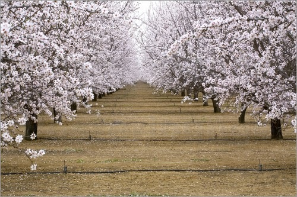
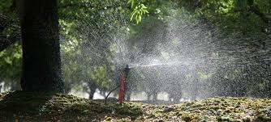

```{r setup, include=FALSE}
knitr::opts_chunk$set(echo = TRUE)
library(tidyverse)
library(here)
library(sensitivity)
```

## Optimization in R - a more complex example

Lets say we have an option to purchase irrigation water;

-   the contract requires us to commit to purchasing the irrigation water for a number of years in the future;
-   we want to know how much irrigation water to purchase to maximize our profit from growing almonds (or some other crop)



## Optimization in R

What we have

-   we have a model of yield as a function of irrigation and climate
-   we have a cost of irrigation water and prices for yields
-   we have all of this for 10 years



## Model {.scrollable}

Our Question: What is the optimal irrigation amount given price of crop and cost of irrigation?

Start with a model of crop yields that includes the impact of irrigation on yields, given some crop parameters and precipitation and temperature

**compute_yield**

We also have a model of profit that accounts for price of the crop and costs of irrigation

**compute_profit**

## Coupled models

-   recall how we combined yield, NPV and profit models together into a single function - a wrapper function

-   *compute_profit* - calls *compute_yield*

We can use **optimize** here on our coupled model - leave one input or parameter "free" - e.g use for upper and lower bounds in the optimation

We will keep irrigation "free"

## Structure of our Model {.scrollable}

compute_yield

-   T annual temperature (C)

-   P annual precipitation (mm)

-   irr irrigation in (mm)

-   crop.pars

    ```         
    * max.water  maximum water requirement (mm)
    * Topt optimal temperature (C)
    * ts slope on temperature/yield relationship
    * tp slope on precipitation/yield relationship
    * base.yield baseline yield  (kg)
    ```

Additional Parameters for Compute_Profit

-   discount (for computing NPV)
-   price. (price for yield \$/kg)
-   cost (cost of irrigation \$/mm)

## Example Optimization {.scrollable}

```{r irrigationopt}
source(here("R/compute_profit.R"))
source(here("R/compute_yield.R"))
source(here("R/compute_NPV.R"))

compute_profit

compute_yield

compute_NPV
crop_pars <- c(ts = 0.4, tp = 0.5, base.yield = 500, Topt = 25, max.water = 800)
precip = c(250,144,100)
temp = c(20,30,25)
crop_price = 50
# lets assume water cost $150 per mm/yr (depth of water per crop area)
water_price = 150
discount = 0.01

optimize(compute_profit, lower = 0, upper = 400, T = temp, P = precip, discount =discount, price = crop_price, cost = water_price, crop.pars = crop_pars, maximum = TRUE)

water_price = 25
# try with cheaper water
optimize(compute_profit, lower = 0, upper = 400, T = temp, P = precip, discount =discount, price = crop_price, cost = water_price, crop.pars = crop_pars, maximum = TRUE)

```

## Sensitivity analysis AND optimization?

Why not?

You can run your optimization for a range of water prices

-   Informal Sensitivity
-   Sobol


## Water price vs optimal irrigation


## Sobol with some help with copilot

Helps to do it in steps 

* model code
* wrapper function 
* parameter samplinng using sobol 
* run wrapper function 
* send results back to sobol object \* analyze sensitvity

```{r, testing}

optimize(compute_profit, lower = 0, upper = 400, T = temp, P = precip, discount =discount, price = crop_price, cost = water_price, crop.pars = crop_pars, maximum = TRUE) 
# write a function that takes as input all the parameters for compute_profit, runs the optimization and returns the optimal irrigation and profit 
optimize_profit <- function(T, P, discount, price, cost, ts, tp, base.yield, Topt, max.water) {
  crop_pars <- c(ts = ts, tp = tp, base.yield = base.yield, Topt = Topt, max.water = max.water)
  opt <- optimize(compute_profit, lower = 0, upper = 400, T = T, P = P, discount =discount, price = price, cost = cost, crop.pars = crop_pars, maximum = TRUE)
  return(list(opt_irrigation = opt$maximum, opt_profit = opt$objective))
}

# test the above function with the same parameters as before use R code
optimize_profit(T = temp, P = precip, discount =discount, price = crop_price, cost = water_price, ts = crop_pars["ts"], tp = crop_pars["tp"], base.yield = crop_pars["base.yield"], Topt = crop_pars["Topt"], max.water = crop_pars["max.water"])


## now use sobol to see how optimal irrigation changes with different parameters, assume a 10% variation in all parameters

# first create X1 by assuming all parameters are normally distributed with a mean of the value we used before and a standard deviation of 10% of that value

X1 \<- data.frame(T = rnorm(1000, mean = temp, sd = 0.1*temp), P = rnorm(1000, mean = precip, sd = 0.1*precip), discount = rnorm(1000, mean = discount, sd = 0.1*discount), price = rnorm(1000, mean = crop_price, sd = 0.1*crop_price), cost = rnorm(1000, mean = water_price, sd = 0.1*water_price), ts = rnorm(1000, mean = crop_pars\["ts"\], sd = 0.1*crop_pars\["ts"\]), tp = rnorm(1000, mean = crop_pars\["tp"\], sd = 0.1*crop_pars\["tp"\]), base.yield = rnorm(1000, mean = crop_pars\["base.yield"\], sd = 0.1*crop_pars\["base.yield"\]), Topt = rnorm(1000, mean = crop_pars\["Topt"\], sd = 0.1*crop_pars\["Topt"\]), max.water = rnorm(1000, mean = crop_pars\["max.water"\], sd = 0.1*crop_pars\["max.water"\]))

# Repeat for X2

X2 \<- data.frame(T = rnorm(1000, mean = temp, sd = 0.1*temp), P = rnorm(1000, mean = precip, sd = 0.1*precip), discount = rnorm(1000, mean = discount, sd = 0.1*discount), price = rnorm(1000, mean = crop_price, sd = 0.1*crop_price), cost = rnorm(1000, mean = water_price, sd = 0.1*water_price), ts = rnorm(1000, mean = crop_pars\["ts"\], sd = 0.1*crop_pars\["ts"\]), tp = rnorm(1000, mean = crop_pars\["tp"\], sd = 0.1*crop_pars\["tp"\]), base.yield = rnorm(1000, mean = crop_pars\["base.yield"\], sd = 0.1*crop_pars\["base.yield"\]), Topt = rnorm(1000, mean = crop_pars\["Topt"\], sd = 0.1*crop_pars\["Topt"\]), max.water = rnorm(1000, mean = crop_pars\["max.water"\], sd = 0.1*crop_pars\["max.water"\]))

# create sobol object

sobol_opt \<- sobolSalt(model = NULL, X1, X2, nboot=200) \# name the parameters colnames(sobol_opt$X) <- c("T", "P", "discount", "price", "cost", "ts", "tp", "base.yield", "T", "max.water")
# run optimization for each parameter set
opt_results <- list(sobol_opt$X) %\>% pmap(optimize_profit) \# extract optimal irrigation and profit from results opt_irrigation \<- opt_results %\>% map_dbl(\~ .x$minimum)
opt_profit <- opt_results %>% map_dbl(~ .x$objective) \# add to sobol object sobol_opt = tell(sobol_opt, opt_irrigation) sobol_opt\$S

```

